<h1 align="center">
Welcome To My Homepage! 
</h1>

Bridging data, science & strategy
🚀 Machine Learning 
🛠️ Tool Development 
📦 R Software 
🧭 Leadership 
🧬 Life Sciences Domain Expert 
✨ Director of Data Science @ [Cercle.ai](https://www.cercle.ai/)

🔬 **Domain expertise**: IVF clinical analysis, proteomics, biomarker discovery, predictive modeling

📊 **Technical tools**: R, machine learning, statistics, experimental design, reproducible research

💪 **Strengths**: Translating complexity, cross-functional collaboration, storytelling with data

-----------

> "Making predictions is easy ... making accurate ones is much more difficult."
>   ⎯ Me⎯

-----------

<h2 align="center">🧬 About Me 🧬</h2>

I love to solve problems.

Often the problem can be understanding a complex biological process, but
it can also be as simple as fixing something that's broken
(e.g. a door that jams, a bicycle, or even machine learning software).
In particular, I like to apply my data science skills to better
understand, or even solve, the problems we face.

I am always open to discuss possible roles 🔭 and whether my skill set
can solve problems in your space!

### Skills

| Machine Learning 🚀    | Statistics 📊        | Open-Source 💻 | Software Tools 🔧 |
|:---------------------- |:-------------------- |:-------------- |:----------------- |
| Random forest          | Regression problems  | R              | Linux🐧, MacOS 🍎 |
| Naive Bayes            | Real-world data (RWD)| C++            | Git, GitHub :octocat: |
| Lasso regularization   | GLMs                 | CI/CD          | AWS               |
| k-Nearest neighbour    | Causal inference IPTW| LaTeX          | BASH, GNU         |
| PCA                    | Survival analysis    | Python 🐍      | Docker 🐋         |
| Maximum-likelihood     | Linear mixed-effects | Opencode       | LLM/Agentic workflows |

### Current Skills Application as Director of Data Science

* Execute organization's data science strategy, aligning
  analytics with business and clinical goals
* Instituted a culture of rigorous, reproducible analysis --
  shifting the team from reactive one-off requests to disciplined
  workflows emphasizing data quality as the primary standard
* Deliver causal inference analyses on large-scale reproductive
  health data (IPTW, propensity scoring, covariate balancing)
  to inform clinical treatment protocol decisions
* Lead our key pharmaceutical partnerships, translating
  multi-arm observational results into clinical insights
* Collaborate with customers and C-suite to create
  framework for data-based decision making
* Architect and maintain a company-wide \R analytics ecosystem
  -- standardizing workflows from data ingestion through Quarto-driven
  client reporting
* Build and mentor a data science team of 3-5; own hiring,
  statistical analysis plans, code review, and technical growth

-----

## Tech Notes & Vignettes 📚

| Topic 🚀                                               | Thumbnail 📈     |
|:------------------------------------------------------ |:----------------:|
| [False Discovery](articles/false-pos-q-values.md)      | <a href="articles/false-pos-q-values.md">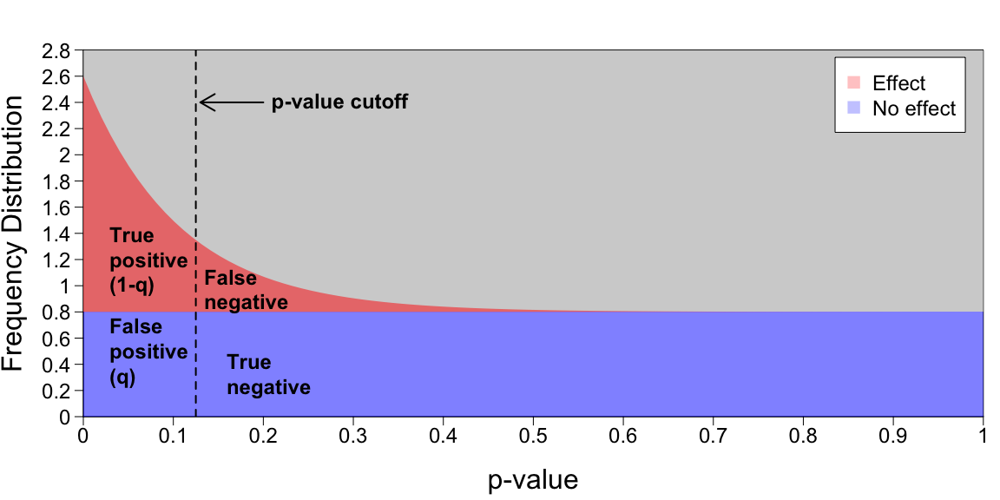</a> |
| [Mixture Models](articles/mixture-em.md)               | <a href="articles/mixture-em.md">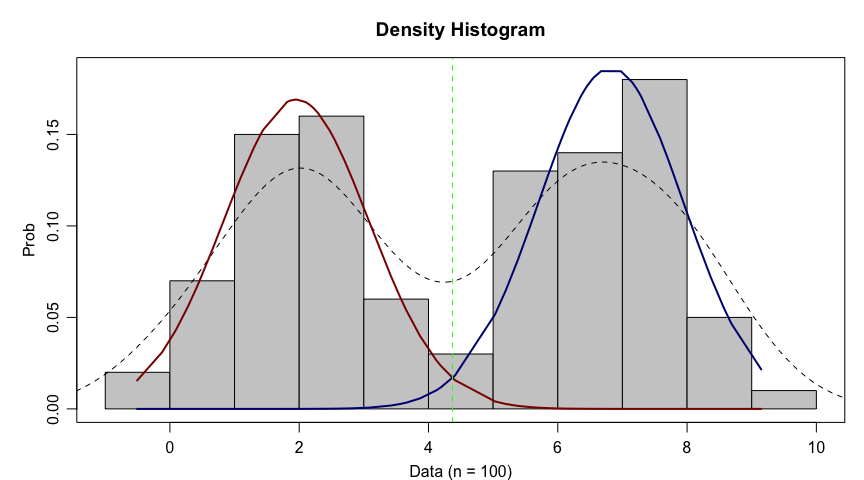</a> |
| [Logistic Regression](articles/logistic-regression.md) | <a href="articles/logistic-regression.md">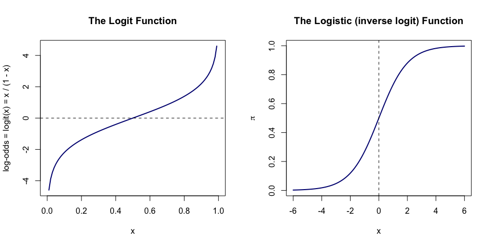</a> |
| [Naive Bayes](articles/naive-bayes-tech-note.md)       | <a href="articles/naive-bayes-tech-note.md">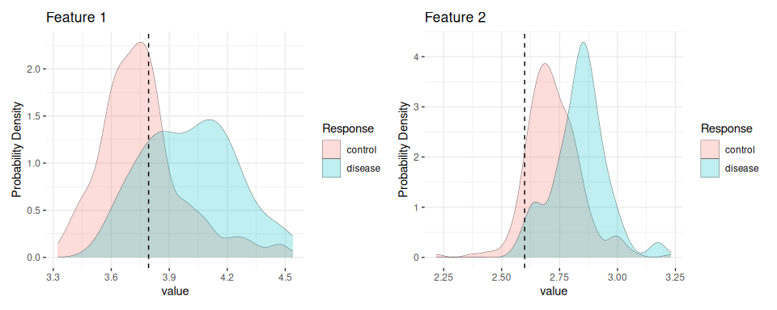</a> |
| [The Birthday Paradox](articles/birthday-paradox.md)   | <a href="articles/birthday-paradox.md">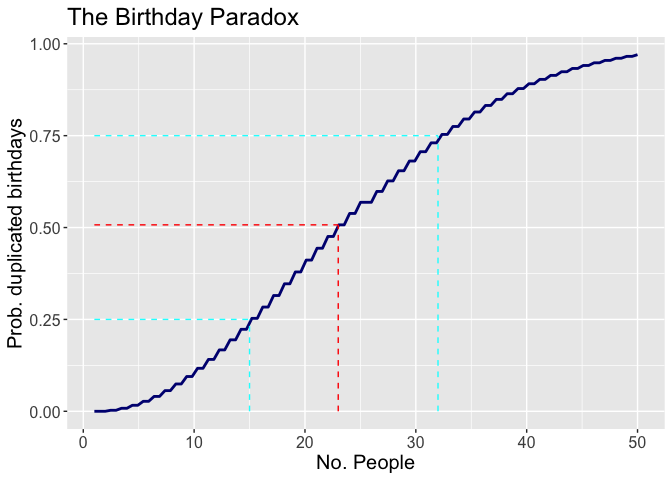</a> |
| [Mack-Wolfe Tests](articles/mack-wolfe.md)             | <a href="articles/mack-wolfe.md">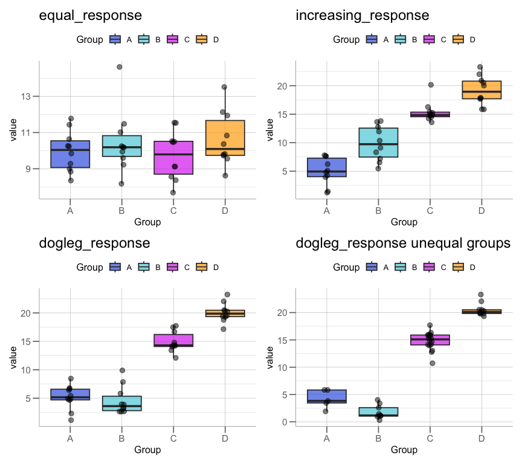</a> |
| [Mixed Effects](articles/mixed-effects-models.md)      | <a href="articles/mixed-effects-models.md">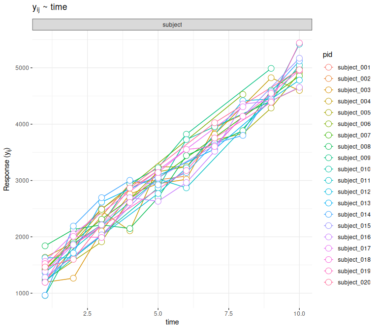</a> |
| [Monty Hall Paradox](articles/monty-hall-paradox.md)   | <a href="articles/monty-hall-paradox.md">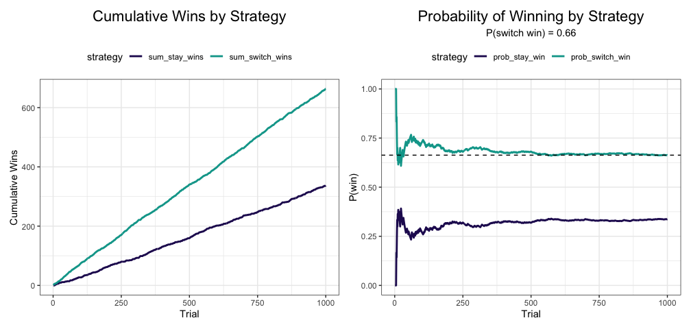</a> |
| [Decision Boundaries](articles/decision-boundaries.md) |  |
| [Class Imbalance](articles/class-imbalance.md)         | <a href="articles/class-imbalance.md">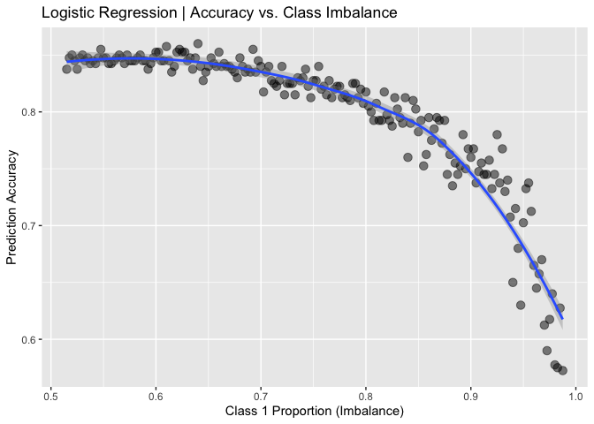</a> |
| [Pitch Classifier](articles/baseball-strike-classifier.md) | <a href="articles/baseball-strike-classifier.md">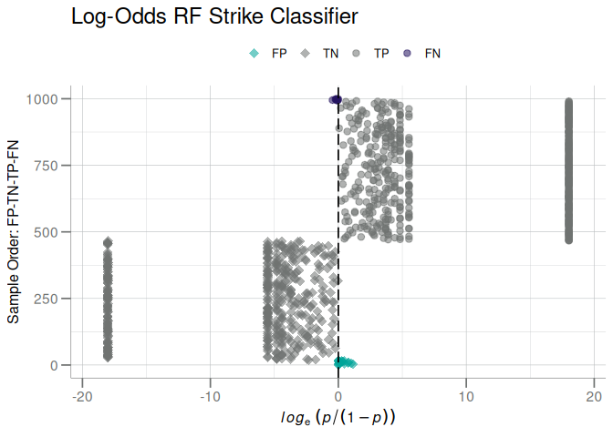</a> |

## 📊 GitHub Stats

<h3 align="center">⏳ GitHub Profile ⏳</h3>

  <a href="./profile-3d-contrib/profile-night-green.svg">
    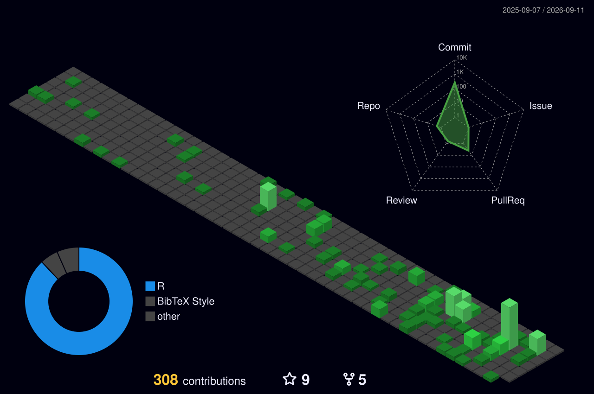
  </a>

<h3 align="center">🔥 Commit Streak 🔥</h3>

  

 

  

### 🔧 GitHub Favorites 🤩

------------

### Other Interests

- 💬 Favorite food: 🐟 🌮
- 📚 I am currently learning woodworking 🪵 ... I'm mostly good at making a lot of sawdust!
- 💬 Ask me about: bikes and `R` ... I'll talk your 👂 off!
- 🚴 I'm an avid cyclist:
  come say hi on [][3]

----------------

<!-- links to your social media accounts -->
[1]: https://github.com/stufield
[2]: https://www.linkedin.com/in/stu-field
[3]: https://www.strava.com/athletes/3292229
[4]: https://www.instagram.com/carlito_caliente/
[5]: https://twitter.com/stufield3

<!--
**stufield/stufield** is a ✨ _special_ ✨ repository because its `README.md` (this file) appears on your GitHub profile.
https://emojipedia.org/emoji/
https://www.fileformat.info/index.htm
https://imgur.com
-->
