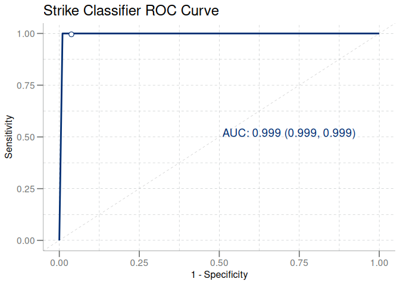

# Baseball Analytics: Strike Classifier
Stu Field

# Overview

Add general overview of the aim of the analysis etc …

Pitch data were obtained from [FanGraphs](https://www.fangraphs.com/)

----------------------------------------------------------------------

## Modeling Approach

1.  **Explore features**:
    - there are 54705 pitches (strikes) for analysis
    - visually and heuristically to identify likely candidates that
      may be predictive with the response variable `is_strike`
2.  **Feature reduction**: using a combination of
    - step-wise forward/backward feature selection
    - [Stability
      Selection](https://rss.onlinelibrary.wiley.com/doi/10.1111/j.1467-9868.2010.00740.x)
    - [R package](https://stufield.github.io/stabilityselectr/)
    - [PCA](https://en.wikipedia.org/wiki/Principal_component_analysis)
3.  **Fit binary classification models**:
    - Logistic Regression
    - [Random
      Forest](https://www.geeksforgeeks.org/random-forest-algorithm-in-machine-learning/)
    - Naive Bayes
4.  **Evaluate and Refine**:
    - make predictions
    - evaluate metrics

## Model Features

The `pitch_data` object contains 21 possible features that could be
used in a putative classification model to predict `is_strike`:

``` r
pitch_data
#> # A tibble: 54,705 × 22
#>    is_strike inning is_bottom balls strikes outs_before is_lhp is_lhb pitch_type
#>        <int>  <int>     <int> <int>   <int>       <int>  <int>  <int> <chr>     
#>  1         1      1         0     0       0           0      0      0 FF        
#>  2         0      1         0     0       1           0      0      0 FF        
#>  3         0      1         0     0       0           0      0      0 SL        
#>  4         0      1         0     1       0           0      0      0 FF        
#>  5         1      1         0     2       0           0      0      0 SL        
#>  6         0      1         0     0       0           1      0      1 CH        
#>  7         0      1         0     1       0           1      0      1 FF        
#>  8         0      1         0     2       1           1      0      1 FF        
#>  9         1      1         0     3       1           1      0      1 FF        
#> 10         1      1         1     0       0           0      0      1 FT        
#> # ℹ 54,695 more rows
#> # ℹ 13 more variables: bat_score_before <int>, field_score <int>,
#> #   basecode_before <int>, batterid <chr>, pitcherid <chr>, cid <chr>,
#> #   hp_umpid <chr>, plate_location_x <dbl>, plate_location_z <dbl>,
#> #   rel_speed <dbl>, spin_rate <dbl>, induced_vert_break <dbl>,
#> #   horizontal_break <dbl>

table(pitch_data$is_strike)  # slight class imbalance
#> 
#>     0     1 
#> 37530 17175

# rm first row: is_strike is the response!
tibble::enframe(sapply(pitch_data, class)) |> tail(-1L)
#> # A tibble: 21 × 2
#>    name             value    
#>    <chr>            <chr>    
#>  1 inning           integer  
#>  2 is_bottom        integer  
#>  3 balls            integer  
#>  4 strikes          integer  
#>  5 outs_before      integer  
#>  6 is_lhp           integer  
#>  7 is_lhb           integer  
#>  8 pitch_type       character
#>  9 bat_score_before integer  
#> 10 field_score      integer  
#> # ℹ 11 more rows
```

Notice there is a class imbalance in the strike response (~ 2:1) which
could be problematic generalizing to new data outside of these
training data. See my other tutorial on the dangers of class imbalance
[here](https://github.com/stufield/stufield/blob/main/articles/class-imbalance.md).
Since there samples (pitches) are not in short supply (unlike in, for
examples, biological data sets), I will simply down sample the major
class for training.

``` r
pitch_data2 <- rebalance(pitch_data, is_strike)

table(pitch_data2$is_strike)  # class imbalance removed
#> 
#>     0     1 
#> 17175 17175
```

I used a combination of univariate testing, forward- and
backward-feature selection, stability selection, and simple heuristics
(i.e common sense to exclude certain variables) to arrive at a final
feature set.

The following 4 features were chosen:

``` r
feats <- c("plate_location_x",
           "plate_location_z",
           "strikes",
           "balls")
```

Not surprisingly, `plate_location_*` coordinates were by far the most
significant predictors in most model building exercises, followed by
`balls` and `strikes`. As one would expect, the pitch count was highly
influential on upcoming pitch location. Incidentally, PCA revealed
`spin_rate` dominated the variance, as it was the first (principal)
component containing over 99% of the total variance, however this
variation was *not* associated with `is_strike`.

## Fit Model

I evaluated numerous model types and eventually decided on a Random
Forest model. In my experience CART methods can perform especially
well with discrete variables/predictors (i.e. `strikes` and `balls`).

``` r
rf_model <- withr::with_seed(123, {  # set seed for reproducibility
  randomForest::randomForest(        # use randomForest package
    as.matrix(pitch_data2[, feats]),  # feature data matrix
    as.factor(pitch_data2$is_strike), # convert response to factor
    ntree = 250
  )
})

# Gini Importance by feature
get_gini(rf_model)
#> # A tibble: 4 × 2
#>   Feature          Gini_Importance
#>   <chr>                      <dbl>
#> 1 plate_location_z           7674.
#> 2 plate_location_x           7398.
#> 3 strikes                     768.
#> 4 balls                       234.
```

and predict strike probability:

``` r
rf_probs <- predict(rf_model,
                    newdata = pitch_data2[, feats], # predict on *training* data
                    type = "prob")[, 2L]            # class 2 = strike

# confusion matrix
cmat <- calc_confusion(pitch_data2$is_strike, rf_probs, pos_class = 1L)

summary(cmat) # evaluate performance
#> ══ Confusion Matrix Summary ════════════════════════════════════════════════════
#> ── Confusion ───────────────────────────────────────────────────────────────────
#> 
#> Positive Class: 1
#> 
#>      Predicted
#> Truth     0     1
#>     0 16566   609
#>     1    91 17084
#> ── Performance Metrics (CI95%) ─────────────────────────────────────────────────
#> 
#> # A tibble: 10 × 5
#>    metric              n estimate CI95_lower CI95_upper
#>    <chr>           <int>    <dbl>      <dbl>      <dbl>
#>  1 Sensitivity     17175   0.995      0.993      0.996 
#>  2 Specificity     17175   0.965      0.961      0.968 
#>  3 PPV (Precision) 17693   0.966      0.963      0.969 
#>  4 NPV             16657   0.995      0.993      0.996 
#>  5 Accuracy        34350   0.980      0.978      0.981 
#>  6 Bal Accuracy    34350   0.980      0.978      0.981 
#>  7 Prevalence      34350   0.5        0.494      0.506 
#>  8 AUC             34350   0.999      0.999      0.999 
#>  9 Brier Score     34350   0.0176     0.0160     0.0191
#> 10 MCC                NA   0.960     NA         NA
#> ── Additional Statistics ───────────────────────────────────────────────────────
#> 
#> F_measure    G_mean    Wt_Acc 
#>     0.980     0.980     0.987
```

Model performance was surprisingly accurate. Stark contrast to my
experience in Life Sciences (proteomics) where performance is
typically *much* lower and `AUC > 0.95` are uncommon.

Also keep in mind that performance here was evaluated on the
*training* data, and a typical machine learning training and test
setup would certainly generate reduced *test* performance.

That said, it should be noted that random forest models do perform a
sort of *quasi*-internal cross-validation, out-of-bag (OOB) samples,
that should guard (somewhat) against over-fitting.

## Append predictions to original data

It is often safer to immediately append the predicted probabilities to
the original data set so they do not become out-of-sync:

``` r
pitch_data2$strike_prob <- rf_probs

dplyr::select(pitch_data2, all_of(feats), is_strike, strike_prob)
#> # A tibble: 34,350 × 6
#>    plate_location_x plate_location_z strikes balls is_strike strike_prob
#>               <dbl>            <dbl>   <int> <int>     <int>       <dbl>
#>  1            0.972            2.03        0     1         0       0.348
#>  2            0.979            3.01        1     0         0       0.212
#>  3           -0.995            1.30        1     0         0       0.068
#>  4            1.35             2.61        0     1         0       0    
#>  5            1.09             3.81        2     3         0       0.02 
#>  6            0.379           -0.734       2     1         0       0    
#>  7            1.11             2.76        0     2         0       0.104
#>  8            1.53             3.00        0     0         0       0.016
#>  9           -1.62             1.52        1     1         0       0.004
#> 10            0.778            2.12        0     0         0       0.712
#> # ℹ 34,340 more rows
```

## ROC

At this point generating a ROC curve of the predictive performance of
the model is superfluous, but I’ll do it anyway:

``` r
plot_emp_roc(pitch_data2$is_strike, pitch_data2$strike_prob, pos_class = 1L,
             plot_fit = TRUE, lwd = 1, cutoff_shape = 21,
             cutoff_size = 2.5, outline = FALSE, col = "#002D72") +
  ggtitle("Strike Classifier ROC Curve")
#> Warning: Using `size` aesthetic for lines was deprecated in ggplot2 3.4.0.
#> ℹ Please use `linewidth` instead.
#> ℹ The deprecated feature was likely used in the libml package.
#>   Please report the issue to the authors.
#> Warning: The `size` argument of `element_line()` is deprecated as of ggplot2 3.4.0.
#> ℹ Please use the `linewidth` argument instead.
#> ℹ The deprecated feature was likely used in the libml package.
#>   Please report the issue to the authors.
```



Perhaps another visual that can be useful is a log-odds plot, where
the predictions are plotted against the decision boundary to see how
close they are. Sort of a visual representation of the Brier Score.

Because there are 34350 samples, this plot can become cluttered so I
will randomly sample 1000 pitches to represent patterns in the
predictions.

``` r
odds_data <- withr::with_seed(100, dplyr::sample_n(pitch_data2, size = 1000L))
plot_log_odds(odds_data$is_strike, odds_data$strike_prob, pos_class = 1L) +
  ggplot2::ggtitle("Log-Odds RF Strike Classifier")
```


A curious pattern emerges:

1.  incorrectly classed pitches are directly next to the boundary line
    (which is good!).
2.  there are a subset (majority?) of pitches with extreme
    probabilities, that have been thresholded by the plotting routine.
    The classifier is *absolutely* sure about these predictions,
    however, what is responsible for the gap between these clusters?
    This is odd. **TODO:** look into this further … something with a
    Random Forest?

----------------------------------------------------------------------

# Session Info

<details class="code-fold">
<summary>Code</summary>

``` r
get_session_info()
#> $packages
#>  package      * version    date (UTC) lib source
#>  cli            3.6.6      2026-04-09 []  RSPM
#>  digest         0.6.39     2025-11-19 []  RSPM
#>  dplyr        * 1.2.1      2026-04-03 []  RSPM
#>  evaluate       1.0.5      2025-08-27 []  RSPM
#>  farver         2.1.2      2024-05-13 []  RSPM
#>  fastmap        1.2.0      2024-05-15 []  RSPM
#>  gbm            2.3.1      2026-07-09 []  RSPM
#>  generics       0.1.4      2025-05-09 []  RSPM
#>  ggplot2      * 4.0.3      2026-04-22 []  RSPM
#>  glue           1.8.1      2026-04-17 []  RSPM
#>  gtable         0.3.6      2024-10-25 []  RSPM
#>  helpr        * 0.0.2.9000 2026-08-19 []  Github (stufield/helpr@db72926)
#>  htmltools      0.5.9      2025-12-04 []  RSPM
#>  igraph         2.3.3      2026-06-26 []  RSPM
#>  jsonlite       2.0.0      2025-03-27 []  RSPM
#>  kknn           1.4.1      2025-05-19 []  any (@1.4.1)
#>  knitr          1.51       2025-12-20 []  any (@1.51)
#>  labeling       0.4.3      2023-08-29 []  RSPM
#>  lattice        0.22-9     2026-02-09 []  CRAN (R 4.6.1)
#>  libml        * 0.0.1.9000 2026-08-19 []  Github (stufield/libml@e2aebe0)
#>  lifecycle      1.0.5      2026-01-08 []  RSPM
#>  magrittr       2.0.5      2026-04-04 []  RSPM
#>  Matrix         1.7-5      2026-03-21 []  CRAN (R 4.6.1)
#>  otel           0.2.0      2025-08-29 []  RSPM
#>  pillar         1.11.1     2025-09-17 []  RSPM
#>  pkgconfig      2.0.3      2019-09-22 []  RSPM
#>  purrr          1.2.2      2026-04-10 []  RSPM
#>  R6             2.6.1      2025-02-15 []  RSPM
#>  randomForest * 4.7-1.2    2024-09-22 []  RSPM
#>  RColorBrewer   1.1-3      2022-04-03 []  RSPM
#>  Rcpp           1.1.2      2026-07-05 []  RSPM
#>  rlang          1.3.0      2026-07-05 []  RSPM
#>  rmarkdown      2.31       2026-03-26 []  RSPM
#>  S7             0.2.2      2026-04-22 []  RSPM
#>  scales         1.4.0      2025-04-24 []  RSPM
#>  sessioninfo    1.2.4      2026-06-04 []  any (@1.2.4)
#>  survival       3.8-6      2026-01-16 []  CRAN (R 4.6.1)
#>  tibble         3.3.1      2026-01-11 []  any (@3.3.1)
#>  tidyr          1.3.2      2025-12-19 []  any (@1.3.2)
#>  tidyselect     1.2.1      2024-03-11 []  RSPM
#>  utf8           1.2.6      2025-06-08 []  RSPM
#>  vctrs          0.7.3      2026-04-11 []  RSPM
#>  withr        * 3.0.3      2026-06-19 []  RSPM
#>  wranglr      * 0.0.2.9000 2026-08-19 []  Github (stufield/wranglr@cd4c5f4)
#>  xfun           0.60       2026-07-09 []  RSPM
#>  yaml           2.3.12     2025-12-10 []  RSPM
#> 
#>  * ── Packages attached to the search path.
#> 
#> $platform
#>  setting  value
#>  version  R version 4.6.1 (2026-06-24)
#>  os       Ubuntu 24.04.4 LTS
#>  system   x86_64, linux-gnu
#>  ui       X11
#>  language (EN)
#>  collate  C.UTF-8
#>  ctype    C.UTF-8
#>  tz       UTC
#>  date     2026-08-21
#>  pandoc   3.1.3 @ /usr/bin/ (via rmarkdown)
#>  quarto   1.10.18 @ /usr/local/bin/quarto
```

</details>
