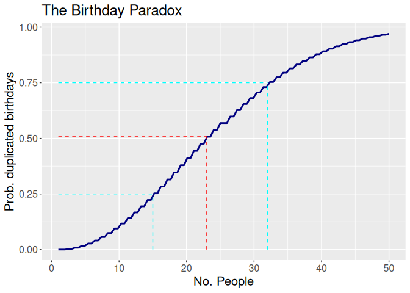

# The Birthday Paradox

Stu Field

18 May 2025

# The Birthday Paradox

In probability theory, the birthday problem asks for the probability
that, in a set of n randomly chosen people, at least two will share a
birthday. The birthday paradox refers to the counter-intuitive fact that
only 23 people are needed for that probability to exceed 50%.

This is the [Birthday
Paradox](https://en.wikipedia.org/wiki/Birthday_problem).

## Summary

- you take 23 random people
- what is the probability that any two birthdays occur on the same day?
- In `R`, this is `runif(min = 1, max = 365)` $\times 23$.
- To answer, first calculate the probability that all 23 birthdays occur
  on *different* days ($P(x)$), then the two are mutually exclusive,
  $P(x') = 1 - P(x)$ is the probability that all birthdays are *not* on
  different days

Thus,

$$
P(x) = \frac{365}{365} \times \frac{364}{365} \times \frac{363}{365} \times\ ...\ \times \frac{343}{365}
$$

which can be simplified to,

$$
P(x) = \bigg(\frac{1}{365}\bigg)^{23} \times \big(365 \times 364 \times\ ...\ \times 343\big)
$$

This can be represented in `R` like so:

``` r
px <- (1 / 365)^23 * prod(365:343)
px
#> [1] 0.4927028

# probability of NOT all different
(1 - px)
#> [1] 0.5072972
```

We can next write a generalized function for this “duplicated”
probability representing *any* number of people for any number of days
in a year (leap year?) and call it `prob_fun()`.

``` r
# x = number of people (trials), can be vectorized
# dpy = days-per-year
prob_fun <- function(x, dpy = 365L) {
  x <- as.integer(x)
  vapply(x, \(.x) {
    v <- seq(dpy, dpy - .x + 1L)
    1 - (1 / dpy)^.x * prod(v)
  }, NA_real_, USE.NAMES = FALSE)
}
ppl <- 23
prob_fun(ppl)   # confirms the above
#> [1] 0.5072972
```

## Visualize `n` People

This can be generalized across an arbitrary number of people to get a
overall view of how probability changes as a function of the opportunity
for duplicate birthdays. Using the `prob_fun()` function above, the
red-dashed line represents the $n =$ 23 days described in classic
example. The cyan-dashed lines are reference lines for 25% and 75%
respectively.

``` r
base <- ggplot() + xlim(1, 50)
base +
  geom_function(fun = prob_fun, colour = "navy", linewidth = 1) +
  labs(title = "The Birthday Paradox", x = "No. People",
       y = "Prob. duplicated birthdays") +
  annotate("segment",
           x = c(ppl, 1), xend = rep(ppl, 2),
           y = c(0, prob_fun(ppl)), yend = rep(prob_fun(ppl), 2),
           linetype = "dashed", colour = "red"
  ) +
  annotate("segment",
           x = c(32, 1), xend = rep(32, 2),
           y = c(0, 0.75), yend = c(0.75, 0.75),
           linetype = "dashed", colour = "cyan"
  ) +
  annotate("segment",
           x = c(15, 1), xend = rep(15, 2),
           y = c(0, 0.25), yend = c(0.25, 0.25),
           linetype = "dashed", colour = "cyan"
  ) +
 theme(text = element_text(size = 15))
```



## Simulation

Next, let’s simulate this. I draw 23 “people” from the uniform
distribution:

$$
X \sim U(1, 365),
$$

and count the number of times the same number is drawn *exactly* twice
on *any* day of the year. I repeat this 10000 times and determine an
empirical probability of the event occurring.

``` r
reps <- 10000
rsim <- withr::with_seed(101,              # set seed for reproducibility
  replicate(
    reps,                                  # nsims
    round(runif(ppl, min = 1, max = 365))) # n = 23; X ~ U(1, 365)
)
counts <- apply(rsim, 2, \(.x) table(.x))  # tabulate counts of duplicate wells
dupes <- vapply(counts, \(.x) any(.x == 2), NA) # any (>1) duplicates present!
prob  <- mean(dupes)
prob
#> [1] 0.507
```

### Caveats

1.  the *same* day could be selected *more* than twice; this simulation
    reflects the probability that *exactly* 2 people are chosen with the
    same birthday (not 3 or more).

2.  the *same* birthday could be selected twice multiple times; this
    simulation reflects the probability that two people are chosen with
    the same birthday *at least* once (but could be more).

Considering the 2 caveats above, the simulation agrees fairly well with
the closed form solution described above and from `prob_fun()`.
