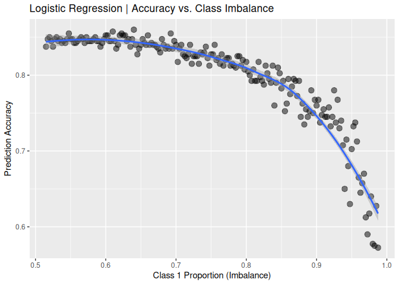

# Effect of Class Imbalance on Prediction Accuracy; a cautionary tale of balance

Stu Field

19 May 2025

--------------------------------------------------------------------------------

# Overview of Setup

- logistic regression binary classification model
- initial global data set of 800 samples \>\>\> 50/50 classes
- random split data into 400 training set, 400 test set
- test set is used for Accuracy calculations
- at each iteration the training set is bootstrap sampled from class 1 *only*
- at the same time, class 2 is down-sampled by the same amount, resulting in a
  larger and larger class-imbalance (1 \> 2)

--------------------------------------------------------------------------------

## Simulate Data

Simulate some bivariate data to predict classes

``` r
# total global sample set size
n <- 800

# create tibble of simulated data
sim_data <- withr::with_seed(1, {
  tibble(F1 = rnorm(n), F2 = rnorm(n)) |> # 2 features; F1 & F2
    dplyr::mutate(
      y  = rep(1:2L, each = n / 2),
      # For F1 only class 1; bump noise [1,2]
      F1 = ifelse(y == 1, F1 + runif(n, 1, 2), F1),
      # For F2 only class 1; bump unif noise [1,3]
      F2 = ifelse(y == 1, F2 + runif(n, 1, 3), F2),
      y  = factor(y),           # convert -> factor for model building
      id = dplyr::row_number()  # add ID to track samples
    )
})
```

## Look at Data

Plot the simulated data based on the 2 predictors (by class)

``` r
sim_data |>
  ggplot(aes(x = F2, y = F1, colour = y)) +
  geom_point(alpha = 0.5, size = 3) +
  scale_colour_manual(values =  c("#00A499", "#24135F"))
```


## Split Data

Random split of simulated data into 50/50 training and test sets

``` r
# random select half of 200 samples for training
train <- withr::with_seed(101, dplyr::sample_frac(sim_data, 0.5))
# merge on `id`s NOT present in the training set
test <- dplyr::anti_join(sim_data, train, by = "id") |>
  dplyr::select(-id)               # remove the tracking field `id` from test
train <- dplyr::select(train, -id) # remove the tracking field `id` from train
```

## Run Simulation

- increasing the class imbalance as it proceeds
- one-in-one out algorithm. Bootstrap add 1 sample from class 1
- randomly remove 1 sample from class 2
- this generates a class imbalance but maintains training size

``` r
set.seed(1234)
n1 <- table(train$y)[["1"]]
n2 <- table(train$y)[["2"]]
simres <- lapply(seq(190), function(.x) { # more iterations -> no class 2 left; trouble fitting
    # create c1 training samples for this round
    c1_boot <- dplyr::filter(train, y == 1) |> # filter only the class 1 samples
      dplyr::sample_n(size    = n1 + .x,       # bootstrap class 1 samples
                      replace = TRUE)          # with replacement

    # create c2 training samples for this round
    c2_down <- dplyr::filter(train, y == 2) |> # filter only the class 2 samples
      dplyr::sample_n(size = n2 - .x)    # randomly down-sample class 2; no replacement

    train_boot <- rbind(c1_boot, c2_down)  # combine boot c1 w down-sampled c2
    class_prop <- mean(train_boot$y == 1) # calc. proportion c1

    stopifnot(nrow(c1_boot) + nrow(c2_down) == nrow(train)) # sanity check; stable size
    
    # fit logistic-regression model
    logr <- stats::glm(y ~ F1 + F2,          # y ~ F1 + F2
                       data = train_boot,    # use the new imbalanced training set
                       family = "binomial")  # `binomial` = logistic regression

    acc <- data.frame(
      true_class = test$y,                    # true class names from test set
      pred       = predict(logr,
                           newdata = dplyr::select(test, -y), # predicted `probabilities`
                           type = "response") # this ensures prob. space; not log-odds
    )
    acc$pred_class <- factor(ifelse(acc$pred < 0.5, 1L, 2L)) # probs -> classes (cutoff = 0.5)
    conf <- table(acc$true_class, acc$pred_class, dnn = list("Actual", "Predicted"))
    tibble(
      n1            = nrow(c1_boot),    # collect output in `tibble`
      n2            = nrow(c2_down),    # number of class 2
      class_balance = class_prop,       # class 1 proportion
      accuracy      = sum(diag(conf)) / sum(conf) # accuracy
    )              
  }) |>
  dplyr::bind_rows(.id = "iter")

simres  # view the `tibble` of simulation results
#> # A tibble: 190 × 5
#>    iter     n1    n2 class_balance accuracy
#>    <chr> <int> <int>         <dbl>    <dbl>
#>  1 1       206   194         0.515    0.838
#>  2 2       207   193         0.518    0.848
#>  3 3       208   192         0.52     0.85 
#>  4 4       209   191         0.522    0.845
#>  5 5       210   190         0.525    0.838
#>  6 6       211   189         0.528    0.848
#>  7 7       212   188         0.53     0.85 
#>  8 8       213   187         0.532    0.845
#>  9 9       214   186         0.535    0.848
#> 10 10      215   185         0.538    0.842
#> # ℹ 180 more rows
```

## Class imbalance vs. prediction accuracy

- Simulation starts with class 1 at 51.5% and Accuracy = 0.838.

- Simulation ends with class 1 at 98.75% and Accuracy = 0.573.

``` r
simres |>
  ggplot(aes(x = class_balance, y = accuracy)) +
  geom_point(alpha = 0.5, size = 3) +
  geom_smooth(formula = y ~ x, method = "loess") +
  labs(x = "Class 1 Proportion (Imbalance)", y = "Prediction Accuracy",
       title = "Logistic Regression | Accuracy vs. Class Imbalance")
```


