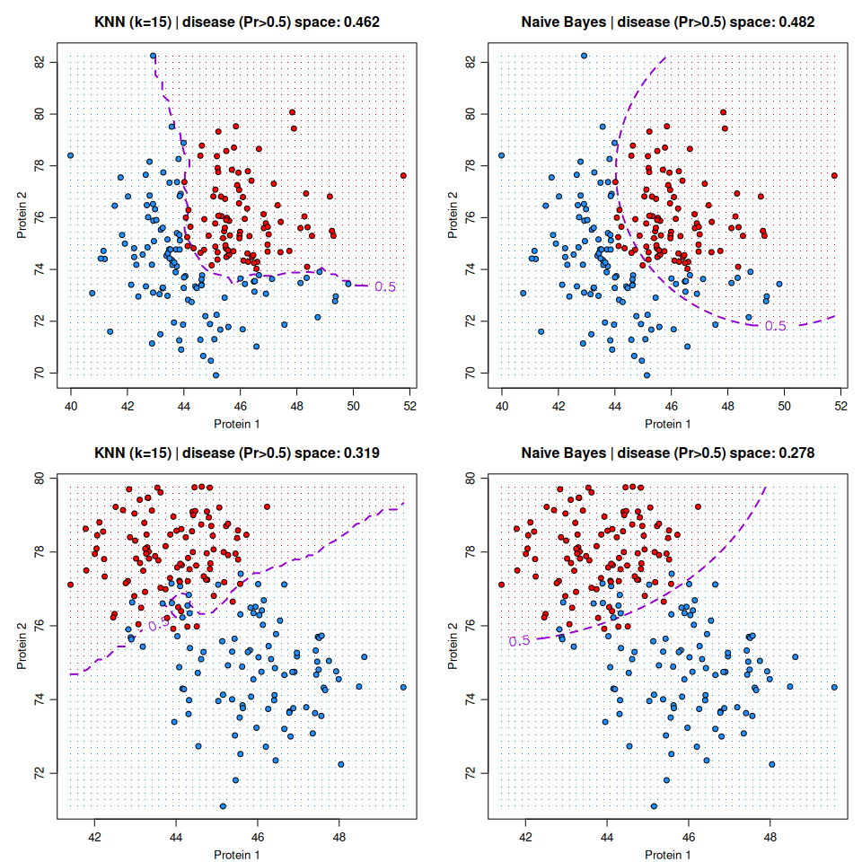
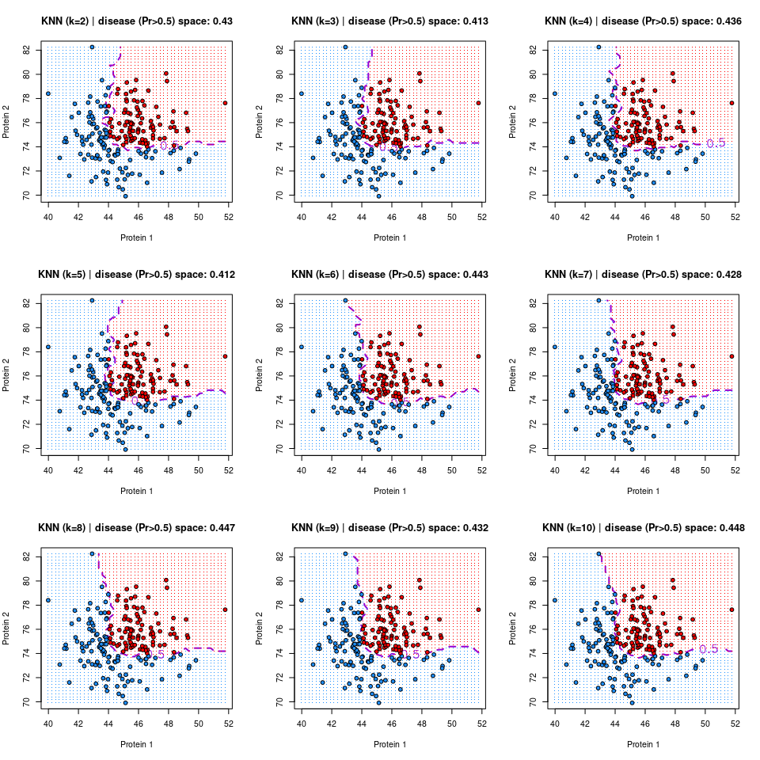

# Decision boundaries: KKNN vs Naïve Bayes
Stu Field
19 September 2024

------------------------------------------------------------------------

# Overview

It is sometimes nice to visualize the decision boundaries of various
models. Here we compare 2 commonly used models: naïve Bayes and
k-nearest neighbors.

## KNN vs naïve Bayes

Below are decision boundaries for 2 simulated data sets using K-Nearest
Neighbors and naïve Bayes models. For the first data set (top row) the
true boundary is simulated such that disease (red) protein 1 $> 44$ and
protein 2 $> 74$, these the data are simulated with an unrealistic harsh
cutoff to form the classes (unrealistic). The lower 2 panels are more
realistic data simulated from bivariate normal distributions and show
the difference in the boundary between the two methods.

``` r
par_def <- list(mgp = c(2.00, 0.75, 0.00), mar = c(3, 4, 3, 1))
par(par_def)
par(mfrow = c(2L, 2L))
plot_decision_boundary(fake_data(), res = 15, model.type = "knn")
plot_decision_boundary(fake_data(), res = 15, model.type = "bayes")
plot_decision_boundary(fake_data2(), res = 15, model.type = "knn")
plot_decision_boundary(fake_data2(), res = 15, model.type = "bayes")
```



## Choosing *k* in KNN

``` r
par(mfrow = c(3L, 3L))
for ( i in 2:10 ) {
  plot_decision_boundary(fake_data(), res = 15, model.type = "knn", k = i)
}
```


