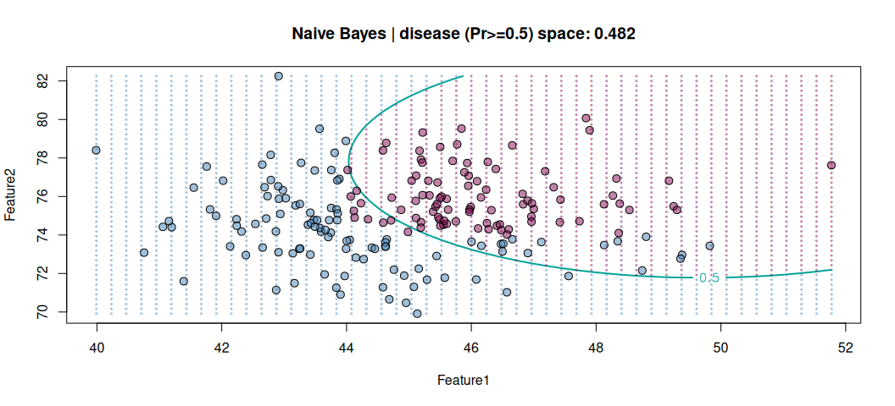
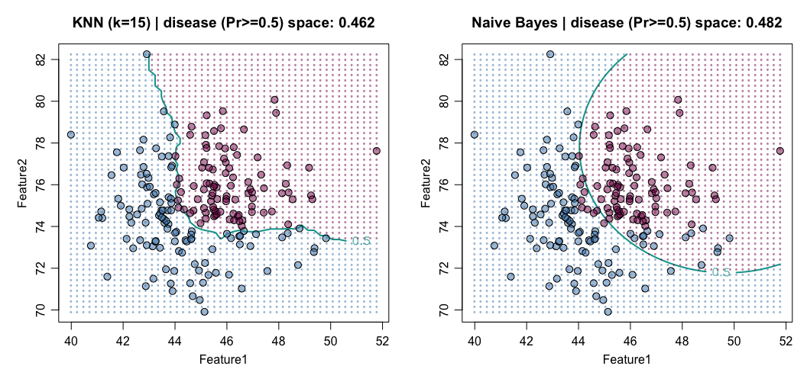
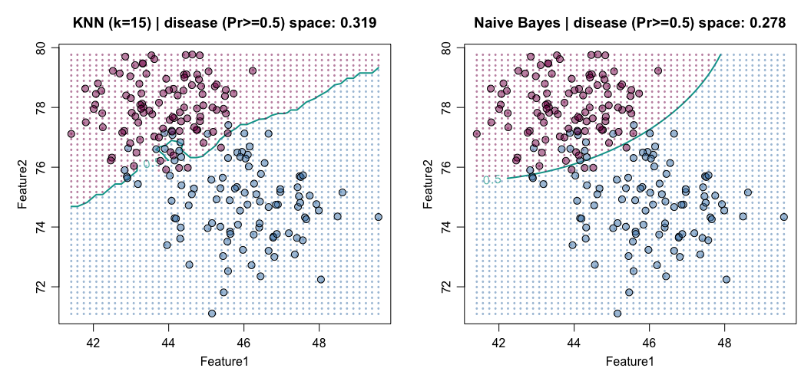

# Decision boundaries: KNN vs Naïve Bayes
Stu Field

# Overview

It can be useful to visualize the decision boundaries of various
models. Here we compare 2 commonly used models:

- Naïve Bayes
- *k*-nearest neighbors (KNN)

----------------------------------------------------------------------

## KNN vs Naïve Bayes

Below are decision boundaries for 2 simulated data sets using
*k*-nearest neighbors and Naïve Bayes models. In the first data set
(upper 2 panels) the true class boundary is simulated such that the
disease (purple) Feature_1 \> 44 and Feature_2 \> 74, these data are
simulated with an *unrealistic* threshold to form the classes. The
lower panels are simulated from bivariate normal distributions,
somewhat more realistic, and show the difference in the boundary
between the two methods.








## Choosing *k* in KNN

``` r
withr::with_par(
  list(mgp   = c(2.00, 0.75, 0.00),
       mar   = c(3, 4, 3, 1),
       mfrow = c(3L, 3L)), {
  for ( i in 2:10L ) {
    plot_decision_boundary(sim_data1(), k = i)
  }
})
```


----------------------------------------------------------------------

### Code Reference

``` r
# simulated data set 1
sim_data1
#> function (n = 200) 
#> {
#>     withr::local_seed(1001)
#>     df <- data.frame(x1 = rnorm(n, 45, 2), x2 = rnorm(n, 75, 
#>         2))
#>     df$y <- factor(ifelse(df$x1 < 44 | df$x2 <= 74, "control", 
#>         "disease"))
#>     df
#> }
#> <bytecode: 0x557ec2fc6278>

# simulated data set 1
sim_data2
#> function (n = 100) 
#> {
#>     withr::local_seed(999)
#>     df1 <- data.frame(x1 = rnorm(n, 46, 1.5), x2 = rnorm(n, 75, 
#>         1.5))
#>     df2 <- data.frame(x1 = rnorm(n, 44, 1), x2 = rnorm(n, 78, 
#>         1))
#>     df <- rbind(df1, df2)
#>     df$y <- factor(rep(c("control", "disease"), each = n))
#>     df
#> }
#> <bytecode: 0x557ebd64e7d8>

# predicting nearest neighbors from scratch
predict_bivariate_knn
#> function (X, y, k, newdata, method = "minkowski") 
#> {
#>     if (k < 2L) {
#>         stop("Neighborhood (k) must be > 1: ", k, call. = FALSE)
#>     }
#>     if (missing(newdata)) {
#>         newdata <- X
#>     }
#>     X <- data.matrix(X)
#>     ntr <- nrow(X)
#>     if (length(y) != ntr) {
#>         stop(sprintf("Length of class vector [y=%i] unequal to n training samples (n=%i)", 
#>             length(y), ntr), call. = FALSE)
#>     }
#>     if (ntr < k) {
#>         warning(sprintf("Neighborhood (k=%i) exceeds training data (n=%i) ... resetting k=%i", 
#>             k, ntr, ntr), call. = FALSE)
#>         k <- ntr
#>     }
#>     nte <- nrow(newdata)
#>     class_names <- names(table(y))
#>     neighbor_list <- lapply(seq_len(nte), function(.i) {
#>         new_vals <- newdata[.i, ]
#>         if (length(new_vals) != 2L) {
#>             stop("Problem with new values ... length =", length(new_vals), 
#>                 call. = FALSE)
#>         }
#>         dist_vec <- sort(setNames(head(dist(rbind(new_vals, X), 
#>             method = method), ntr), seq_len(ntr)))
#>         as.integer(names(head(dist_vec, k)))
#>     })
#>     neighbor_prop_disease <- vapply(neighbor_list, function(.x) {
#>         prop.table(table(y[.x]))[[class_names[2L]]]
#>     }, double(1))
#>     classes <- ifelse(neighbor_prop_disease == 0.5, sample(class_names, 
#>         1, prob = prop.table(table(y))), ifelse(neighbor_prop_disease >= 
#>         0.5, class_names[2L], class_names[1L]))
#>     data.frame(class = classes, prob = neighbor_prop_disease)
#> }
#> <bytecode: 0x557ec2d75170>

# plotting routine for decision boundary
plot_decision_boundary
#> function (data, res = 50L, model_type = c("knn", "bayes"), k = 15L, 
#>     line_col = "#00A499", lwd = 2, lty = 1, contours = 0.5) 
#> {
#>     y <- data$y
#>     X <- data[, c("x1", "x2")]
#>     x1 <- data$x1
#>     x2 <- data$x2
#>     x1grid <- seq(min(x1), max(x1), length = res)
#>     x2grid <- seq(min(x2), max(x2), length = res)
#>     grid <- expand.grid(x1 = x1grid, x2 = x2grid, KEEP.OUT.ATTRS = FALSE)
#>     model_type <- match.arg(model_type)
#>     if (model_type == "bayes") {
#>         rm(k)
#>         model <- libml::fit_nb(y ~ ., data = data)
#>         prob_vec <- predict(model, grid, type = "raw")[["disease"]]
#>         title <- "Naive Bayes | disease (Pr>=0.5) space: "
#>     }
#>     else if (model_type == "knn") {
#>         model <- predict_bivariate_knn(X, y, k, grid)
#>         prob_vec <- model$prob
#>         title <- sprintf("KNN (k=%i) | disease (Pr>=0.5) space: ", 
#>             k)
#>     }
#>     prob_grid <- matrix(prob_vec, nrow = res)
#>     pos_space <- round(sum(prob_grid >= 0.5)/res^2, 3L)
#>     contour(x = x1grid, y = x2grid, z = prob_grid, levels = contours, 
#>         lwd = lwd, lty = lty, labcex = 1, vfont = c("sans serif", 
#>             "bold"), col = line_col, xlab = "Feature1", ylab = "Feature2", 
#>         main = paste0(title, pos_space), axes = TRUE)
#>     col_d <- ggplot2::alpha("#840B55", 0.5)
#>     col_c <- ggplot2::alpha("steelblue", 0.5)
#>     points(grid, pch = "•", cex = 0.75, col = ifelse(prob_vec >= 
#>         0.5, col_d, col_c))
#>     points(X, cex = 1.25, pch = 21, col = 1, bg = ifelse(y == 
#>         "disease", col_d, col_c))
#>     invisible(data)
#> }
#> <bytecode: 0x557ec192dab0>
```

----------------------------------------------------------------------

# Session Info

<details class="code-fold">
<summary>Code</summary>

``` r
get_session_info()
#> $packages
#>  package      * version    date (UTC) lib source
#>  cli            3.6.6      2026-04-09 []  RSPM
#>  digest         0.6.39     2025-11-19 []  RSPM
#>  dplyr        * 1.2.1      2026-04-03 []  RSPM
#>  evaluate       1.0.5      2025-08-27 []  RSPM
#>  farver         2.1.2      2024-05-13 []  RSPM
#>  fastmap        1.2.0      2024-05-15 []  RSPM
#>  gbm            2.3.1      2026-07-09 []  RSPM
#>  generics       0.1.4      2025-05-09 []  RSPM
#>  ggplot2        4.0.3      2026-04-22 []  RSPM
#>  glue           1.8.1      2026-04-17 []  RSPM
#>  gtable         0.3.6      2024-10-25 []  RSPM
#>  helpr        * 0.0.2.9000 2026-08-19 []  Github (stufield/helpr@db72926)
#>  htmltools      0.5.9      2025-12-04 []  RSPM
#>  igraph         2.3.3      2026-06-26 []  RSPM
#>  jsonlite       2.0.0      2025-03-27 []  RSPM
#>  kknn           1.4.1      2025-05-19 []  any (@1.4.1)
#>  knitr          1.51       2025-12-20 []  any (@1.51)
#>  lattice        0.22-9     2026-02-09 []  CRAN (R 4.6.1)
#>  libml        * 0.0.1.9000 2026-08-19 []  Github (stufield/libml@e2aebe0)
#>  lifecycle      1.0.5      2026-01-08 []  RSPM
#>  magrittr       2.0.5      2026-04-04 []  RSPM
#>  Matrix         1.7-5      2026-03-21 []  CRAN (R 4.6.1)
#>  otel           0.2.0      2025-08-29 []  RSPM
#>  pillar         1.11.1     2025-09-17 []  RSPM
#>  pkgconfig      2.0.3      2019-09-22 []  RSPM
#>  purrr          1.2.2      2026-04-10 []  RSPM
#>  R6             2.6.1      2025-02-15 []  RSPM
#>  RColorBrewer   1.1-3      2022-04-03 []  RSPM
#>  Rcpp           1.1.2      2026-07-05 []  RSPM
#>  rlang          1.3.0      2026-07-05 []  RSPM
#>  rmarkdown      2.31       2026-03-26 []  RSPM
#>  S7             0.2.2      2026-04-22 []  RSPM
#>  scales         1.4.0      2025-04-24 []  RSPM
#>  sessioninfo    1.2.4      2026-06-04 []  any (@1.2.4)
#>  survival       3.8-6      2026-01-16 []  CRAN (R 4.6.1)
#>  tibble         3.3.1      2026-01-11 []  any (@3.3.1)
#>  tidyr          1.3.2      2025-12-19 []  any (@1.3.2)
#>  tidyselect     1.2.1      2024-03-11 []  RSPM
#>  vctrs          0.7.3      2026-04-11 []  RSPM
#>  withr        * 3.0.3      2026-06-19 []  RSPM
#>  wranglr      * 0.0.2.9000 2026-08-19 []  Github (stufield/wranglr@cd4c5f4)
#>  xfun           0.60       2026-07-09 []  RSPM
#>  yaml           2.3.12     2025-12-10 []  RSPM
#> 
#>  * ── Packages attached to the search path.
#> 
#> $platform
#>  setting  value
#>  version  R version 4.6.1 (2026-06-24)
#>  os       Ubuntu 24.04.4 LTS
#>  system   x86_64, linux-gnu
#>  ui       X11
#>  language (EN)
#>  collate  C.UTF-8
#>  ctype    C.UTF-8
#>  tz       UTC
#>  pandoc   3.1.3 @ /usr/bin/ (via rmarkdown)
#>  quarto   1.10.18 @ /usr/local/bin/quarto
```

</details>
