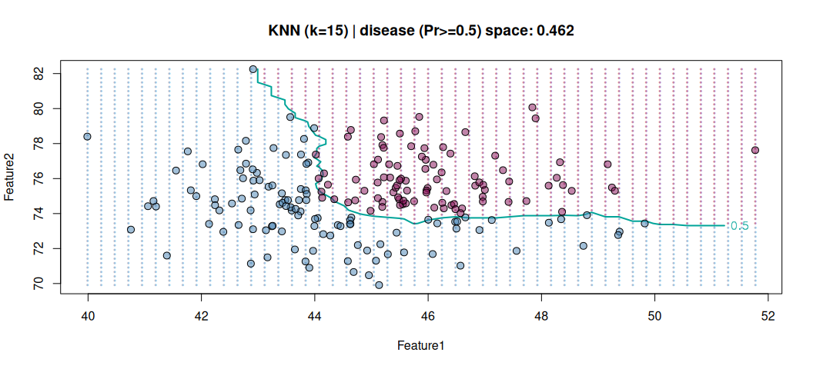
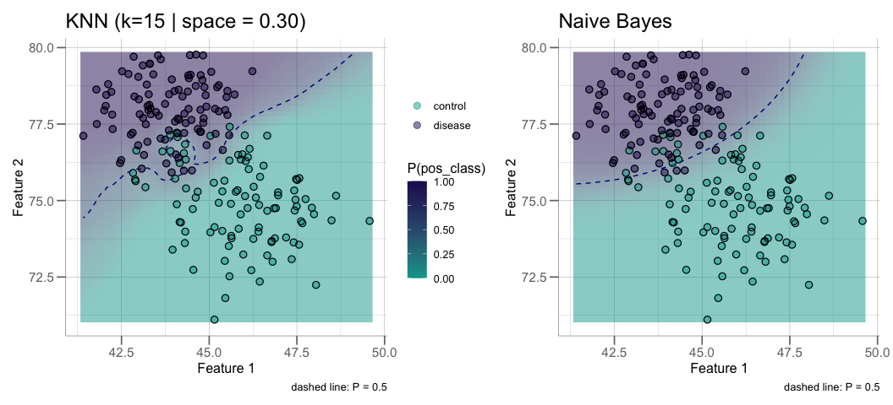
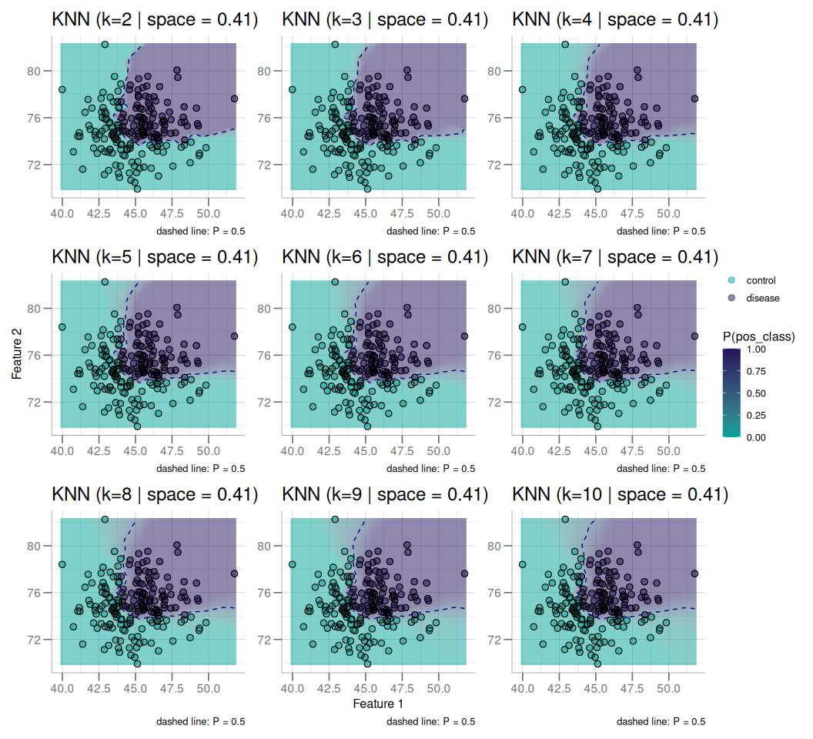

# Decision boundaries: KNN vs Naïve Bayes
Stu Field

# Overview

It can be useful to visualize the decision boundaries of various
models. Here we compare 2 commonly used models:

- *k*-nearest neighbors (KNN)
- Naïve Bayes

----------------------------------------------------------------------

## KNN vs Naïve Bayes

Below are decision boundaries for 2 simulated data sets using
*k*-nearest neighbors and Naïve Bayes models. In the first data set
(upper 2 panels) the true class boundary is simulated such that:

- the disease (purple) Feature_1 \> 44
- Feature_2 \> 74

these data are simulated with an *unrealistic* threshold to form the
classes.



The panels below are simulated from bivariate normal distributions,
somewhat more realistic, and show the difference in the boundary
between the two methods.



## Choosing *k* in KNN

Choosing appropriate *k* for the neighborhood can be difficult, and
often arbitrary. It is often useful to plot the decision boundary at
successive values of *k* and visually inspect.

``` r
pk <- lapply(2:10L, plot_knn_boundary, data = sim_data1())
patchwork::wrap_plots(
  pk, ncol = 3L, guides = "collect", axis_titles = "collect"
)
```



----------------------------------------------------------------------

### Code Reference

``` r
# simulated dataset #1
sim_data1
------------------- 
function (n = 200) 
{
    withr::local_seed(1001)
    df <- data.frame(x1 = rnorm(n, 45, 2), x2 = rnorm(n, 75, 
        2))
    df$y <- factor(ifelse(df$x1 < 44 | df$x2 <= 74, "control", 
        "disease"))
    df
}

# simulated dataset #2
sim_data2
------------------- 
function (n = 100) 
{
    withr::local_seed(999)
    df1 <- data.frame(x1 = rnorm(n, 46, 1.5), x2 = rnorm(n, 75, 
        1.5))
    df2 <- data.frame(x1 = rnorm(n, 44, 1), x2 = rnorm(n, 78, 
        1))
    df <- rbind(df1, df2)
    df$y <- factor(rep(c("control", "disease"), each = n))
    df
}

# plot decision boundary for KNN
plot_knn_boundary
------------------------------------ 
function (data, k = 15L, res = 50L) 
{
    stopifnot(ncol(data) == 3L)
    train <- dplyr::rename_with(dplyr::rename_if(data, is.factor, 
        function(.x) "class"), function(.x) c("F1", "F2"), !"class")
    df <- libml:::expand_grid(list(F1 = seq(min(train$F1), max(train$F1), 
        length = res), F2 = seq(min(train$F2), max(train$F2), 
        length = res)))
    m <- libml::fit_kknn(class ~ ., train = train, test = train, 
        k_neighbors = k)
    pred <- libml::calc_predictions(m, df)
    df$Pr <- pred$prob_disease
    col_palette <- libml:::col_palette
    pos_space <- round(sum(matrix(df$Pr, nrow = res) >= 0.5)/res^2, 
        3L)
    p <- ggplot(df, aes(x = F1, y = F2))
    p + geom_raster(aes(fill = Pr), alpha = 0.5) + geom_contour(aes(x = F1, 
        y = F2, z = Pr), binwidth = 0.501, color = "navy", linewidth = 0.5, 
        linetype = "dashed") + scale_fill_gradient(low = col_palette$lightgreen, 
        high = col_palette$purple, limits = c(0, 1), name = "P(pos_class)", 
        breaks = seq(0, 1, 0.25), guide = guide_colorbar(order = 2)) + 
        geom_point(data = train, aes(x = F1, y = F2, color = class), 
            size = 2.5, alpha = 0.5) + scale_color_manual(values = c(col_palette$lightgreen, 
        col_palette$purple), guide = guide_legend(order = 1)) + 
        geom_point(data = train, aes(x = F1, y = F2), size = 2.5, 
            shape = 21, color = "black") + labs(x = "Feature 1", 
        y = "Feature 2", caption = "dashed line: P = 0.5", title = sprintf("KNN (k=%i | space = %0.2f)", 
            k, pos_space), color = NULL) + libml:::libml_theme(legend_pos = "right") + 
        NULL
}
```

----------------------------------------------------------------------

# Session Info

<details class="code-fold">
<summary>Code</summary>

``` r
get_session_info()
#> $packages
#>  package      * version    date (UTC) lib source
#>  cli            3.6.6      2026-04-09 []  RSPM
#>  digest         0.6.39     2025-11-19 []  RSPM
#>  dplyr        * 1.2.1      2026-04-03 []  RSPM
#>  evaluate       1.0.5      2025-08-27 []  RSPM
#>  farver         2.1.2      2024-05-13 []  RSPM
#>  fastmap        1.2.0      2024-05-15 []  RSPM
#>  gbm            2.3.1      2026-07-09 []  RSPM
#>  generics       0.1.4      2025-05-09 []  RSPM
#>  ggplot2      * 4.0.3      2026-04-22 []  RSPM
#>  glue           1.8.1      2026-04-17 []  RSPM
#>  gtable         0.3.6      2024-10-25 []  RSPM
#>  helpr        * 0.0.2.9000 2026-08-19 []  Github (stufield/helpr@db72926)
#>  htmltools      0.5.9      2025-12-04 []  RSPM
#>  igraph         2.3.3      2026-06-26 []  RSPM
#>  isoband        0.3.0      2025-12-07 []  RSPM
#>  jsonlite       2.0.0      2025-03-27 []  RSPM
#>  kknn           1.4.1      2025-05-19 []  any (@1.4.1)
#>  knitr          1.51       2025-12-20 []  any (@1.51)
#>  labeling       0.4.3      2023-08-29 []  RSPM
#>  lattice        0.22-9     2026-02-09 []  CRAN (R 4.6.1)
#>  libml        * 0.0.1.9000 2026-08-31 []  Github (stufield/libml@fddfa9e)
#>  lifecycle      1.0.5      2026-01-08 []  RSPM
#>  magrittr       2.0.5      2026-04-04 []  RSPM
#>  Matrix         1.7-5      2026-03-21 []  CRAN (R 4.6.1)
#>  otel           0.2.0      2025-08-29 []  RSPM
#>  patchwork    * 1.3.2      2025-08-25 []  any (@1.3.2)
#>  pillar         1.11.1     2025-09-17 []  RSPM
#>  pkgconfig      2.0.3      2019-09-22 []  RSPM
#>  purrr          1.2.2      2026-04-10 []  RSPM
#>  R6             2.6.1      2025-02-15 []  RSPM
#>  RColorBrewer   1.1-3      2022-04-03 []  RSPM
#>  Rcpp           1.1.2      2026-07-05 []  RSPM
#>  rlang          1.3.0      2026-07-05 []  RSPM
#>  rmarkdown      2.31       2026-03-26 []  RSPM
#>  S7             0.2.2      2026-04-22 []  RSPM
#>  scales         1.4.0      2025-04-24 []  RSPM
#>  sessioninfo    1.2.4      2026-06-04 []  any (@1.2.4)
#>  survival       3.8-6      2026-01-16 []  CRAN (R 4.6.1)
#>  tibble         3.3.1      2026-01-11 []  any (@3.3.1)
#>  tidyr          1.3.2      2025-12-19 []  any (@1.3.2)
#>  tidyselect     1.2.1      2024-03-11 []  RSPM
#>  vctrs          0.7.3      2026-04-11 []  RSPM
#>  withr        * 3.0.3      2026-06-19 []  RSPM
#>  wranglr      * 0.0.2.9000 2026-08-19 []  Github (stufield/wranglr@cd4c5f4)
#>  xfun           0.60       2026-07-09 []  RSPM
#>  yaml           2.3.12     2025-12-10 []  RSPM
#> 
#>  * ── Packages attached to the search path.
#> 
#> $platform
#>  setting  value
#>  version  R version 4.6.1 (2026-06-24)
#>  os       Ubuntu 24.04.4 LTS
#>  system   x86_64, linux-gnu
#>  ui       X11
#>  language (EN)
#>  collate  C.UTF-8
#>  ctype    C.UTF-8
#>  tz       UTC
#>  pandoc   3.1.3 @ /usr/bin/ (via rmarkdown)
#>  quarto   1.10.18 @ /usr/local/bin/quarto
```

</details>
