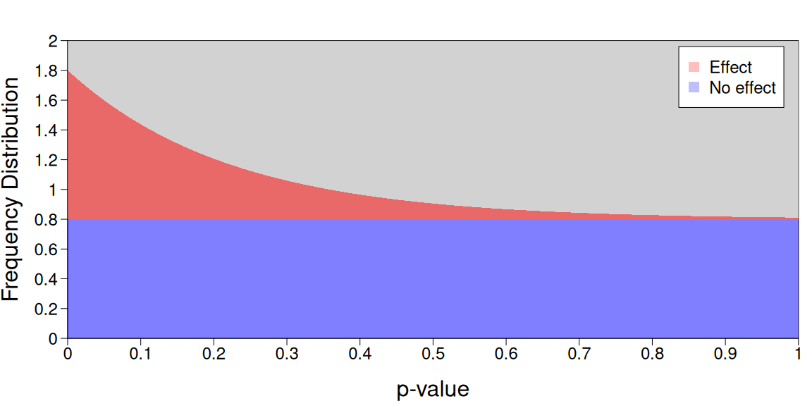
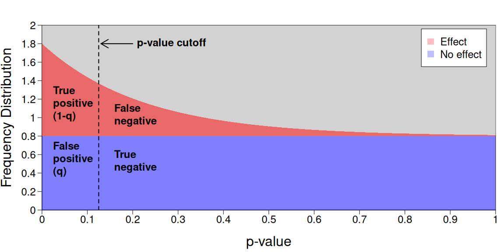

# Mind Your P’s & Q’s

Stu Field

19 May 2025

----------------------------------------------------------------------

# What are false-positives?

A false-positive finding in an experiment occurs when you conclude
that some covariate or predictor variable has an effect on a response
variable when in fact it does not. There is a risk of this occurring
in all experiments, but they can be a particular problem when tests
are done on many of variables (100’s or 1000’s), which happens in
proteomics, genomics, transcriptomics, or metabolomics.

# Why are q-values important?

To see how false discoveries arise, consider an experiment in which
there is no treatment effect on any of the variables measured. In this
case, any positive findings *must* be false. For each of the many
variables, we will have calculated a p-value. What will these p-values
look like? They will appear similar to **Fig. 1**; a uniform
distribution evenly spread between $0\to1$, with 5% of them less than
$p=0.05$. You are as likely to obtain a p-value of 0.01 as 0.99. This
means that if you perform 1000 statistical tests, you can expect 50
significant results *by chance* alone. These are the 5%
false-positives present in every experiment, and they cannot be
reduced by a bigger, better experiment, or a more careful analysis.
False discovery rates (FDRs) and q-values are a way of quantifying
this problem (and alleviating it).

``` r
par(par_def)
x <- seq(0, 1, 0.1)
y <- seq(0, 1.2, 0.2)
plot(NA, type = "n", xaxt = "n", yaxt = "n",
     ylab = "Frequency Distribution", xlab = "p-value", cex.lab = 2,
     xaxs = "i", yaxs = "i", ylim = range(y), xlim = range(x))
axis(1, labels = x, at = x, cex.axis = 1.5)
axis(2, labels = y, at=y, las = 2, cex.axis = 1.5)
add_box(top = 1, col = "blue", alpha = 0.5)
add_box(top = 1.2, bottom = 1, col = "gray", alpha = 0.7)
```


**Fig 1.**: Distribution of p-values when there is no effect (i.e. the
null hypothesis).

Now suppose that we have an experiment where the treatments *do* have
an effect on some of the variables. Let us suppose that 20% of them
are affected (although we do not know this in advance). For the 80%
which are unaffected, their p-values will be evenly spread between
$0\to1$. For the 20% which are affected, the p-values will have a
distribution skewed towards the lower end of the $0\to1$ range. This
means that the total distribution of p-values looks like **Fig. 2**
below:

``` r
basefig <- function(y = seq(0, 2, 0.2), ...) {
  withr::local_par(par_def)
  plot(NA, xlim = 0:1, ylim = range(y), type = "n", xaxt = "n", yaxt = "n",
       ylab = "Frequency Distribution", xlab = "p-value",
       cex.lab = 2, xaxs = "i", yaxs = "i", ...)
  axis(1, labels = x, at = x, cex.axis = 1.5)
  axis(2, labels = y, at = y, las = 2, cex.axis = 1.5)
  add_box(bottom = 0.8, col = "gray", alpha = 0.7)
  add_box(top = 0.8, col = "blue", alpha = 0.5)
  legend("topright", legend = c("Effect", "No effect"), pch = 15,
         bg = "white",  col = c(col_alpha("red", 0.25), col_alpha("blue", 0.25)),
         inset = 0.02, cex = 1.5, pt.cex = 2)
}
xvals <- seq(0, 1, length.out = 100)
alpha <- -4.5
beta  <- 1
yvals <- beta * (exp(xvals * alpha)) + 0.8
basefig()
plot_polygon(list(xvals, yvals), list(x, rep(0.8, length(x))),
             add = TRUE, col = col_alpha("red", 0.5))
```



**Fig 2.**: Distribution of p-values when some (20%) variables are
affected (i.e. the alternate hypothesis; red).

By looking at the shape of this distribution, we can estimate how much
of it is in the “No effect” (rectangular, purple) portion, and how
much is in “Effect” portion (red). Now suppose we choose a p-value
cutoff in order to conclude which variables are affected. This will
effectively divides the variables into 4 types (**Fig. 3**). The
q-value is the proportion of variables chosen as positive (left of the
dotted-line) which are false-positives. In **Fig. 3**, it is ~50% for
the cutoff shown.

``` r
basefig()
plot_polygon(list(xvals, yvals), list(x, rep(0.8, length(x))),
             add = TRUE, col = col_alpha("red", 0.5))
abline(v = 0.125, col = 1, lty = 2, lwd = 2)
add_text(0.015, 0.25, "False\npositive\n(q)", font = 2, cex = 1.5)
add_text(0.015, 0.55, "True\npositive\n(1-q)", font = 2, cex = 1.5)
add_text(0.15, 0.5, "False\nnegative", font = 2, cex = 1.5)
add_text(0.15, 0.25, "True\nnegative", font = 2, cex = 1.5)
add_text(0.2, 0.9, "p-value cutoff", font = 2, cex = 1.5)
arrows(0.2, 1.8, 0.130, 1.8, code = 2, length = 0.2, lwd = 2)
```



**Fig. 3**: Using a p-value cutoff (e.g. $p<0.125$) to decide which
variables are affected.

Now that we have a q-value, we can either use it to quantify the
false-positive problem by estimating what percentage of the variables
declared to be affected are in fact unaffected. Or by choosing a
q-value which we consider acceptable (q-value cutoff), use that to
determine the p-value cutoff to use – it does *not* have to be 5%! It
may be asked at this point that having quantified the false-positives,
can we not say which ones they are? Unfortunately this not possible.
It is like trying to design a fire alarm which makes a different sound
depending on whether it’s a real fire or a false alarm: a nice idea
but it simply won’t work. The only way to find out is to do some more
investigation: search the building for a fire or in the case of
science, do some more research.

# How are q-values calculated?

All that is required is a collection of p-values from the same sort of
statistical tests (e.g. t-test) on the same sort of variable (e.g. gel
spots) in a single experiment. The algorithm views the distribution of
p-values as a mixture of two distributions: the null (uniform) and the
alternate (skewed toward zero). The shape of the null distribution can
be quantified by fitting a mathematical form (typically a spline fit)
to the curve in **Fig. 2**, in order to estimate the y-intercept
characterizing the blue box ($\sim0.8$). If there are truly no
p-values coming from the alternate distribution, this intercept will
be $\sim1.0$ as in **Fig. 1**. There are many statistical tools in
various programs to perform this, in the statistical environment R,
there is a package simply called `qvalue` available from
[Bioconductor](https://www.bioconductor.org/).

# What about false-negatives?

These are also unsatisfactory. We can quantify how many of these we
have, but (like the false-positives) cannot say which variables they
are. The issue of false-negatives is related to the power of the
experiment. By increasing this, such as by doing a bigger experiment
with more replicates, we can push the red part of the distribution
towards the left. An example of what this might look like for the
experiment in **Fig. 3** is shown in **Fig. 4**; there are no more
affected variables, the red area is the same, but we are more likely
to detect them. We have reduced the q-value to ~35% for the same
cutoff ($p = 0.125$).

``` r
basefig(y = seq(0, 2.8, 0.2))
alpha <- -9.5
beta  <- 1.8
yvals <- beta * (exp(xvals * alpha)) + 0.8
plot_polygon(list(xvals, yvals), list(x, rep(0.8, length(x))),
             add = TRUE, col = col_alpha("red", 0.5))
abline(v = 0.125, col = 1, lty = 2, lwd = 2)
add_text(0.02, 0.15, "False\npositive\n(q)", font = 2, cex = 1.5)
add_text(0.02, 0.4, "True\npositive\n(1-q)", font = 2, cex = 1.5)
add_text(0.125, 0.33, "False\nnegative", font = 2, cex = 1.5)
add_text(0.15, 0.1, "True\nnegative", font = 2, cex = 1.5)
add_text(0.2, 0.855, "p-value cutoff", font = 2, cex = 1.5)
arrows(0.2, 2.4, 0.130, 2.4, code = 2, length = 0.2, lwd = 2)
```


**Fig. 4**: p-values for a more powerful version of the experiment in
**Fig. 3**.

# The difference between p- and q-values?

p-values and q-values are the answers to different questions and
attempt to control false discovery in different ways. p-values attempt
to control the conditional probability of obtaining an individual test
statistic given that the null hypothesis is true, $P(statistic|null)$.
The q-value makes sense only in the context of “multiple-testing”,
producing a distribution of p-values and rephrases the question to
answer: “of the significant tests (for a given cutoff), what
proportion are expected to be from the null distribution” (i.e.
false-positives)?

----------------------------------------------------------------------

# Code Reference

``` r
par_def <- list(mar = c(5, 5, 3, 1), mgp = c(3.5, 0.75, 0))

col_alpha <- ggplot2::alpha

add_box <- function(bottom = NULL, top = NULL, left = NULL, right = NULL,
                    col, alpha = 0.2, ...) {
  pars <- par("usr")
  if ( is.null(bottom) )
    bottom <- pars[3L]
  if ( is.null(left) )
    left <- pars[1L]
  if ( is.null(top) )
    top <- pars[4L]
  if ( is.null(right) )
    right <- pars[2L]
  graphics::rect(left, bottom, right, top, border = NA,
                 col = col_alpha(col, alpha), ...)
}

plot_polygon <- function(upper, lower, add = FALSE,
                         col = col_alpha("blue", 0.5), ...) {
  x1 <- upper[[1L]]
  y1 <- upper[[2L]]
  x2 <- lower[[1L]]
  y2 <- lower[[2L]]
  if ( !add ) {
    plot(x1, y1, type = "n", ylim = c(min(y1, y2),
         max(y1, y2)), xlim = c(min(x1, x2), max(x1, x2)), ...)
  }
  graphics::polygon(c(x1, rev(x2)), c(y1, rev(y2)), border = NA, col = col)
}

add_text <- function(x, y, text, pos = 4, ...) {
  pars   <- par("usr")
  plot_x <- pars[1:2L]
  plot_y <- pars[3:4L]
  new_x  <- x * (max(plot_x) - min(plot_x)) + min(plot_x)
  new_y  <- y * (max(plot_y) - min(plot_y)) + min(plot_y)
  if ( par("xlog") ) {
    new_x <- 10^new_x
  }
  if ( par("ylog") ) {
    new_y <- 10^new_y
  }
  text(new_x, new_y, text, pos = pos, ...)
}
```

# References

[Original source](cfile7.uf.tistory.com/attach/207D9A554D2FAEC6169E07)

Storey, J. 2002. A direct approach to false discovery rates. *Journal
of the Royal Society, B*. **64**:479–498.

Storey, J. and Tibshirani, R. 2002. Statistical significance for
genomewide studies. *PNAS*. **100**:9440–9445.
