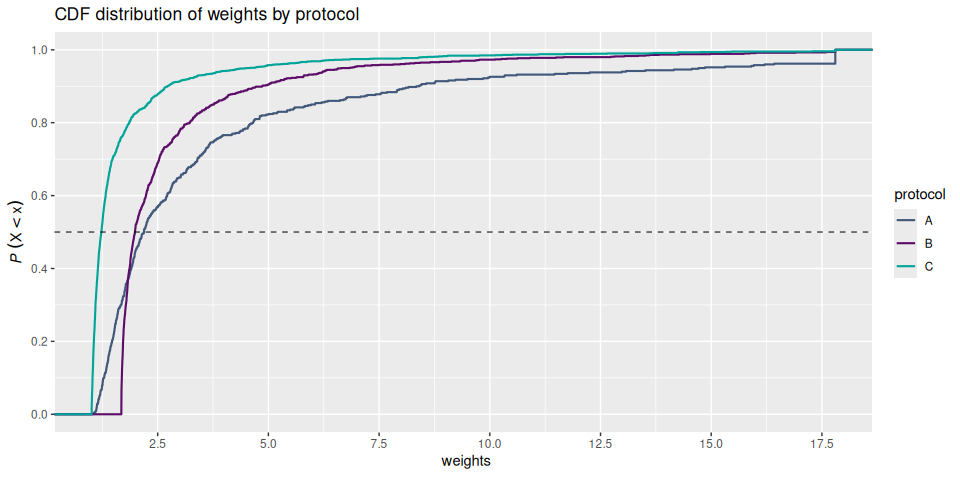

# Clinical Outcomes and Inverse Probability Weighting
Stu Field

*Adjusting for confounded variables in model fit*

# Overview

- Typical modeling of IVF outcomes center around probability of
  pregnancy or live birth from an individual ovarian stimulation cycle
- Cumulative life birth rate (CLBR) is defined as the probability of
  *one or more* positive live birth outcomes, from a completed
  stimulation cycle, *regardless* of oocytes retrieved, fertilized
  oocytes, transferred embryos, or clinical pregnancies.
- **analysis goals**: does CLBR differ by treatment (i.e. protocol)
  type? Does the *type* of FSH administered confer a clinical benefit
  as seen in increased CLBR outcomes?

## The Model

We model the *cumulative* live birth outcome per cycle, $\hat{y}$ =
success or failure, as:

$$ y_i \sim \mathrm{Bernoulli}(p_i) $$

where $y_i \in \{0, 1\}$ = outcome for the $i^{th}$ IVF cycle, $p_i$ =
probability of success for the $i^{th}$ IVF cycle,

$$
\log \left(\frac{p_i}{1 - p_i}\right) = \beta_0 +
  \sum_j \beta_j^{\text{prot}}\,\mathbf{1}[\text{protocol}_i = j] +
$$ $$
  \beta_{\text{age}}(\text{age}_i)\ +
$$ $$
  \beta_{\text{wt}}(\text{bmi}_i)\ +
$$ $$
  \sum_k \gamma_k\,\mathbf{1}[\text{region}_i = k]\ +
$$ $$
  \sum_k \gamma_k\,\mathbf{1}[\text{race}_i = k]
  \epsilon_i
$$

## Model Fit in R

``` r
model <- stats::glm(
  clbr ~ protocol + age + bmi + census_region + race_census,
  family  = binomial("logit"),
  data    = model_data
)
```

# Confounding Variables

- Real World Data (RWD) is full of confounding/uncontrolled variables
  - live clinical data from the wild
  - it is *not* a fully-balanced clinical trial!
- uncontrolled confounding variables are likely
  - covariates are supposed to b independent, but …
  - what if *protocol* is confounded by *age*?

<div style="width: 50%;">

|          | FSH-a | FSH-b | Mix FSH-a + FSH-b |
|:---------|------:|------:|------------------:|
| mean age |  20.5 |  30.3 |              40.4 |

</div>

$$
clbr \sim protocol\ +\ age\ +\ ...\ +\ \epsilon
$$

# Welcome IPW

- Inverse Probability Weighting
- build a classifier (model) predicting *protocol* given *age*
  - if a strong bias exists, age should predict protocol
  - stronger predictions reflect stronger bias
- new model:

$$
\text{protocol} \sim age\ +\ ...\ +\ \epsilon
$$

- invert the probability
  - $\uparrow$ $P(protocol = protocol_k | X)$ down weighted
  - $\downarrow$ $P(protocol = protocol_k | X)$ up weighted
- aggregate effect $\rightarrow$ create pseudo-population that
  de-couples correlation *protocol* $\sim$ *age*

----------------------------------------------------------------------

# Example in R

``` r
set.seed(101)
n_vec <- c(500, 1000, 1500)
sd    <- 2
df <- tibble::tibble(
  protocol = factor(rep(c("A", "B", "C"), times = n_vec)),
  age = c(
    rnorm(n_vec[1L], mean = 10, sd = sd),
    rnorm(n_vec[2L], mean = 12, sd = sd),
    rnorm(n_vec[3L], mean = 15, sd = sd)
  )
)

df |>
  group_by(protocol) |>
  summarize(n = n(), mu = mean(age), sigma = sd(age))
#> # A tibble: 3 × 4
#>   protocol     n    mu sigma
#>   <fct>    <int> <dbl> <dbl>
#> 1 A          500  9.87  1.93
#> 2 B         1000 12.0   2.00
#> 3 C         1500 15.1   1.99

# fit 3-class model
model <- nnet::multinom(protocol ~ age, data = df)
#> # weights:  9 (4 variable)
#> initial  value 3295.836866 
#> iter  10 value 1998.633588
#> final  value 1998.626908 
#> converged
probs <- predict(model, type = "probs")

# P(protocol = protocol_k | X)
row_idx <- 1:nrow(df)
col_idx <- match(df$protocol, colnames(probs))
ps      <- probs[cbind(row_idx, col_idx)]

# invert + trim 1%
df$weights <- trim_weights(1 / ps, c(0.01, 0.99))

tapply(df$weights, df$protocol, quantile, p = 0.5)
#>        A        B        C 
#> 2.188632 1.985535 1.229576

df |>
  plot_cdf(weights, group = protocol) +
  geom_hline(yintercept = 0.5, alpha = 0.75, linetype = "dashed") +
  labs(title = "CDF distribution of weights by protocol")
```




``` r
df |>
  group_by(protocol) |>
  summarize(
    n        = n(),                           # orig sample size
    n_adj    = calc_ess(weights),             # effective sample size
    mean     = mean(age),                        # mu orig
    mean_adj = weighted.mean(age, weights)) |>   # mu adjust
  mutate(prop_n   = .fmt_pct(prop.table(n)),     # prop orig
         prop_adj = .fmt_pct(prop.table(n_adj))) # prop adjust
#> # A tibble: 3 × 7
#>   protocol     n n_adj  mean mean_adj prop_n prop_adj
#>   <fct>    <int> <dbl> <dbl>    <dbl> <chr>  <chr>   
#> 1 A          500  240.  9.87     11.5 16.7%  15.7%   
#> 2 B         1000  592. 12.0      12.9 33.3%  38.8%   
#> 3 C         1500  696. 15.1      13.7 50.0%  45.6%
```

## Final Fit in R

``` r
model <- stats::glm(
  clbr ~ protocol,
  weights = weights,
  family  = quasibinomial("logit"),
  data    = model_data
)
```

----------------------------------------------------------------------

# References

- ASA Regulatory
  [Workshop](https://ww2.amstat.org/meetings/biop/2020/): [Short
  Course](https://ww2.amstat.org/meetings/biop/2020/onlineprogram/handouts/SC4-Handouts.pdf)

- **WeightIt package in R**:
  <https://ngreifer.github.io/WeightIt/index.html>

> [!NOTE]
>
> ### Citation
>
> Greifer N (2026). WeightIt: Weighting for Covariate Balance in
> Observational Studies. doi:10.32614/CRAN.package.WeightIt
> <https://doi.org/10.32614/CRAN.package.WeightIt>. R package version
> 1.7.0, <https://CRAN.R-project.org/package=WeightIt>.

# Session Info

<details class="code-fold">
<summary>Code</summary>

``` r
get_session_info()
#> $packages
#>  package      * version date (UTC) lib source
#>  cli            3.6.6   2026-04-09 []  RSPM
#>  digest         0.6.39  2025-11-19 []  RSPM
#>  dplyr        * 1.2.1   2026-04-03 []  RSPM
#>  evaluate       1.0.5   2025-08-27 []  RSPM
#>  farver         2.1.2   2024-05-13 []  RSPM
#>  fastmap        1.2.0   2024-05-15 []  RSPM
#>  generics       0.1.4   2025-05-09 []  RSPM
#>  ggplot2      * 4.0.3   2026-04-22 []  RSPM
#>  glue           1.8.1   2026-04-17 []  RSPM
#>  gtable         0.3.6   2024-10-25 []  RSPM
#>  htmltools      0.5.9   2025-12-04 []  RSPM
#>  jsonlite       2.0.0   2025-03-27 []  RSPM
#>  knitr          1.51    2025-12-20 []  any (@1.51)
#>  labeling       0.4.3   2023-08-29 []  RSPM
#>  lifecycle      1.0.5   2026-01-08 []  RSPM
#>  magrittr       2.0.5   2026-04-04 []  RSPM
#>  nnet           7.3-20  2025-01-01 []  CRAN (R 4.6.1)
#>  otel           0.2.0   2025-08-29 []  RSPM
#>  patchwork    * 1.3.2   2025-08-25 []  any (@1.3.2)
#>  pillar         1.11.1  2025-09-17 []  RSPM
#>  pkgconfig      2.0.3   2019-09-22 []  RSPM
#>  R6             2.6.1   2025-02-15 []  RSPM
#>  RColorBrewer   1.1-3   2022-04-03 []  RSPM
#>  rlang          1.3.0   2026-07-05 []  RSPM
#>  rmarkdown      2.31    2026-03-26 []  RSPM
#>  S7             0.2.2   2026-04-22 []  RSPM
#>  scales         1.4.0   2025-04-24 []  RSPM
#>  sessioninfo    1.2.4   2026-06-04 []  any (@1.2.4)
#>  tibble         3.3.1   2026-01-11 []  any (@3.3.1)
#>  tidyselect     1.2.1   2024-03-11 []  RSPM
#>  utf8           1.2.6   2025-06-08 []  RSPM
#>  vctrs          0.7.3   2026-04-11 []  RSPM
#>  withr          3.0.3   2026-06-19 []  RSPM
#>  xfun           0.60    2026-07-09 []  RSPM
#>  yaml           2.3.12  2025-12-10 []  RSPM
#> 
#>  * ── Packages attached to the search path.
#> 
#> $platform
#>  setting  value
#>  version  R version 4.6.1 (2026-06-24)
#>  os       Ubuntu 24.04.4 LTS
#>  system   x86_64, linux-gnu
#>  ui       X11
#>  language (EN)
#>  collate  C.UTF-8
#>  ctype    C.UTF-8
#>  tz       UTC
#>  date     2026-08-23
#>  pandoc   3.1.3 @ /usr/bin/ (via rmarkdown)
#>  quarto   1.10.18 @ /usr/local/bin/quarto
```

</details>
