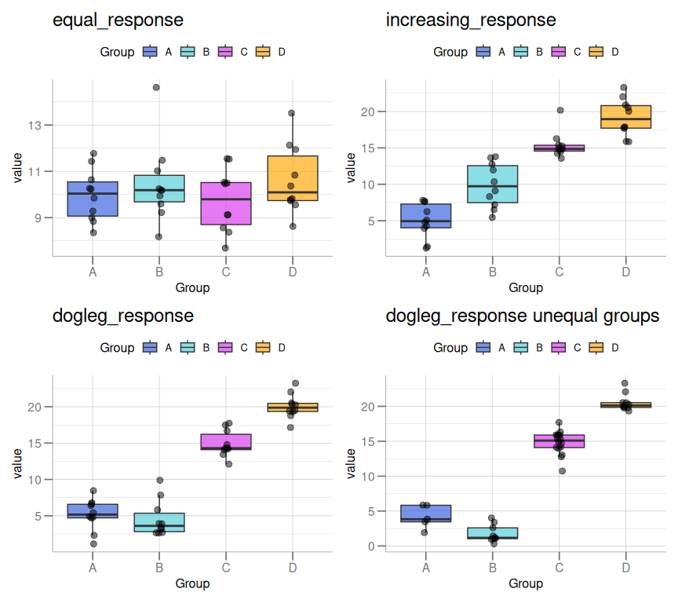

# The Mack-Wolfe Test

Stu Field

15 November 2024

# Mack-Wolfe Non-Parametric Peak Tests

Given an expected group ordering
(i.e. `Group A < Group B < Group C < Group D`), the Mack-Wolfe test
counts for *each* value in `Group A`, the number of values in `Group B`
that are greater in magnitude (+0.5 for ties), and repeats this
calculation for all *each* $n \choose 2$, $n \ge 2$, pairwise
combinations ($A-B$, $A-C$, $A-D$, $B-C$, $B-D$, $C-D$). In the extreme,
if there are 9 samples in `Group A` and 15 samples in `Group B`, and
*all* the samples in `Group B` are greater than the highest value in
`Group A`, this results in $9 \times 15 = 135$ for that pairwise
combination. The process is repeated and summed for the other 5
combinations. See below for 4 different possible JT-test scenarios
(Mack-Wolfe with peak at end).

``` r
mack_fake_data <- function() {
  withr::local_seed(100)
  data.frame(
    equal_degree        = factor(rep(LETTERS[1:4L], each = 10L)),
    unequal_degree      = factor(rep(LETTERS[1:4L], c(5, 9, 16, 10))),
    equal_response      = c(rnorm(10, 10, 2), rnorm(10,10,2), 
                            rnorm(10, 10, 2), rnorm(10, 10, 2)),
    increasing_response = c(rnorm(10, 5, 2), rnorm(10, 10, 2),
                            rnorm(10,15,2), rnorm(10, 20 ,2)),
    dogleg_response     = c(rnorm(10, 5, 2), rnorm(10, 5, 2),
                            rnorm(10, 15, 2), rnorm(10, 20, 2)),
    dogleg_response2    = c(rnorm(5, 5, 2), rnorm(9, 2, 2),
                            rnorm(16, 15, 2), rnorm(10,20,2))
  )
}

test_mack_data <- mack_fake_data()
response_vec   <- c("equal_response", "increasing_response", "dogleg_response") |>
  helpr::set_Names()

mack_tests <- lapply(test_mack_data[, response_vec], function(.x) {
  libml::mack_wolfe(.x, test_mack_data$equal_degree, peak = "jt")
})

mack_tests$dogleg_response2 <- libml::mack_wolfe(
  test_mack_data$dogleg_response2, test_mack_data$unequal_degree, peak = "jt"
)

p <- lapply(response_vec, function(.p) {
   SomaPlotr::boxplotBeeswarm(
     split(test_mack_data[[.p]], test_mack_data$equal_degree),
           notch = FALSE, main = .p)
})

p[[4L]] <- SomaPlotr::boxplotBeeswarm(
  split(test_mack_data$dogleg_response2, test_mack_data$unequal_degree),
  notch = FALSE, main = "dogleg_response unequal groups")

p[[1L]] + p[[2L]] + p[[3L]] + p[[4L]]
```



------------------------------------------------------------------------

For scenarios where there is an expected peak, the test statistic
($A_p$) is calculated as essentially the sum of two JT-tests, summing
over the *upward* side and *downward* side JT-tests.

For example, if **peak = Group C**,
i.e. `Group A < Group B < Group C > Group D`, two tests are calculated
and summed:

$$
\begin{equation}
  (Group\ A < Group\ B < Group\ C) + (Group\ C > Group\ D)
\end{equation}
$$

The significance is inferred typically using a large-sample
approximation to the Gaussian distribution ($A^*$), i.e. conversion to a
$Z_{score}$, from which an associated p-value can be calculated.
