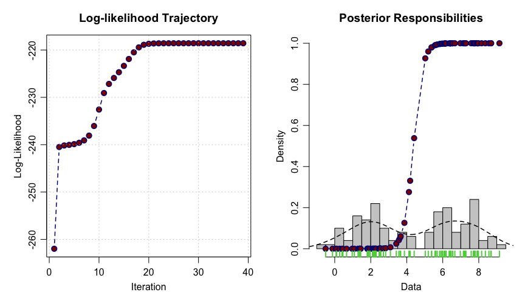

# Mixture Model Expectation-Maximization
Stu Field

----------------------------------------------------------------------

# Mixture E-M

Expectation maximization (E-M) is an iterative procedure (algorithm)
for finding the maximum likelihood solution (estimates) for difficult
maximum likelihood problems (e.g. models with latent variables). This
is achieved in a similar way to *k*-means clustering, however instead
of minimizing the within-cluster variance at each iteration, we
maximize the likelihood of the data by calculating weighted-maximum
likelihood estimates of the parameters at each iteration. We are
trying to fit the model:

<span id="eq-mix-em">$$
\begin{eqnarray}
g(Y) &=& (1-\pi) \phi_{\theta_1}(y) + \pi\phi_{\theta_2}(y), \\
\text{where,} && \\
\hat\pi &=& {\cal P}(x=2),\; x \in \{1,2\}, \\
\phi_{\theta_x}(y) &=& \text{the normal density with parameters } \theta_x, x \in \{1,2\}.
\end{eqnarray}
 \qquad(1)$$</span>

----------------------------------------------------------------------

### The steps are as follows:

1.  Make **initial guesses** for:
    $\hat\mu_1,\ \hat\mu_2,\ \hat\sigma_1^2,\ \hat\sigma_2^2, \text{ and } \hat\pi$:

<span id="eq-algorithm">$$
\begin{eqnarray}
  bins &=& \text{ randomly assign data points to 1 of 2 bins} \\
  \hat\sigma_1^2,\hat\sigma_2^2 &=& 1/rexp(2, rate = sd(bins)) \\
  \hat\mu_1,\hat\mu_2 &=& rnorm(2, mean = mean(bins), sd = c(\hat\sigma_1^2,\hat\sigma_2^2)) \\
  \hat\pi &=& 0.5
\end{eqnarray}
 \qquad(2)$$</span>

2.  **Expectation**: compute *responsibilities* from posterior
    probabilities, where the responsibilities are the relative
    contribution of distribution 2 (the second mode) in *explaining*
    each data point (this is a *soft* assignment). Responsibilities of
    mode 2 for observation $i$ given the current estimates are:

$$
\hat\gamma_i = \frac{\hat\pi\phi_{\theta_2}(y_i)}{(1-\hat\pi)\phi_{\theta_1}(y_i) + \hat\pi\phi_{\theta_2}(y_i)},\quad\quad i = 1,\dots,n.
$$

3.  **Maximization**: compute *weighted* maximum likelihood to update
    the estimates:

<span id="eq-parameters">$$
\begin{eqnarray}
\hat\mu_1 = \frac{\sum\limits_{i=1}^n(1-\hat\gamma_i)y_i}{\sum\limits_{i=1}^n(1-\hat\gamma_i)},
\quad \quad \quad
\hat\mu_2 = \frac{\sum\limits_{i=1}^n\hat\gamma_iy_i}{\sum\limits_{i=1}^n\hat\gamma_i}, \\
\hat\sigma^2_1 = \frac{\sum\limits_{i=1}^n(1-\hat\gamma_i)(y_i-\hat\mu_1)^2}{\sum\limits_{i=1}^n(1-\hat\gamma_i)},
\quad \quad 
\hat\sigma^2_2 = \frac{\sum\limits_{i=1}^n\hat\gamma_i(y_i-\hat\mu_2)^2}{\sum\limits_{i=1}^n\hat\gamma_i}, \\
\hat\pi = \sum\limits_{i=1}^n\frac{\hat\gamma_i}{n}.
\end{eqnarray}
 \qquad(3)$$</span>

4.  Compute log-likelihood:

$$
{\cal L} = \sum_{i=1}^n log\big[\; (1-\hat\pi)\phi_{\theta_1}(y_i) + \hat\pi\phi_{\theta_2}(y_i)\; \big]
$$

5.  Check **convergence**: check if criterion of the log-likelihood
    has been met, if not, repeat above steps with new values of
    $\hat\mu_1,\ \hat\mu_2,\ \hat\sigma_1^2,\ \hat\sigma_2^2, \text{ and } \hat\pi$
    as initial guesses.

----------------------------------------------------------------------

## Run the Algorithm

``` r
# create a mixture distribution with 2 modes; n = 75 for each
data <- withr::with_seed(
  1001, c(rnorm(50, mean = 2, sd = 1), rnorm(50, mean = 7, sd = 1))
)

# default initial parameters
mix_fit <- withr::with_seed(1, normal_k2_mixture(data))
#> ✓ Iteration ... 39
```

## Visualize the Algorithm

Estimates:

``` r
# helpr has a S3 print method
mix_fit
#> ══ Mix Type: normal_k2_mixture ═════════════════════════════════════════════════
#> • n               100
#> • iter            39
#> • mu              [1.954, 6.823]
#> • sigma           [1.126, 1.119]
#> • pi_hat          0.523
#> • lambda          [0.477, 0.523]
#> • final loglik    -218.579
#> ════════════════════════════════════════════════════════════════════════════════
```

``` r
# helpr has a S3 plot method
par(mfrow = c(1, 2L))
plot(mix_fit, "likelihood")
plot(mix_fit, "posterior")
```



``` r
  "Fig. 2: The distribution, overall density, and individual
  densities for the final estimates."
#> [1] "Fig. 2: The distribution, overall density, and individual\n  densities for the final estimates."
#| fig.width: 9
#| fig.height: 5
plot(mix_fit)
```


----------------------------------------------------------------------

# Session Info

<details class="code-fold">
<summary>Code</summary>

``` r
get_session_info()
#> $packages
#>  package     * version    date (UTC) lib source
#>  cli           3.6.6      2026-04-09 []  RSPM
#>  digest        0.6.39     2025-11-19 []  RSPM
#>  dplyr         1.2.1      2026-04-03 []  RSPM
#>  evaluate      1.0.5      2025-08-27 []  RSPM
#>  fastmap       1.2.0      2024-05-15 []  RSPM
#>  generics      0.1.4      2025-05-09 []  RSPM
#>  glue          1.8.1      2026-04-17 []  RSPM
#>  helpr       * 0.0.2.9000 2026-08-19 []  Github (stufield/helpr@db72926)
#>  htmltools     0.5.9      2025-12-04 []  RSPM
#>  jsonlite      2.0.0      2025-03-27 []  RSPM
#>  knitr         1.51       2025-12-20 []  any (@1.51)
#>  lifecycle     1.0.5      2026-01-08 []  RSPM
#>  magrittr      2.0.5      2026-04-04 []  RSPM
#>  otel          0.2.0      2025-08-29 []  RSPM
#>  pillar        1.11.1     2025-09-17 []  RSPM
#>  pkgconfig     2.0.3      2019-09-22 []  RSPM
#>  R6            2.6.1      2025-02-15 []  RSPM
#>  rlang         1.3.0      2026-07-05 []  RSPM
#>  rmarkdown     2.31       2026-03-26 []  RSPM
#>  sessioninfo   1.2.4      2026-06-04 []  any (@1.2.4)
#>  tibble        3.3.1      2026-01-11 []  any (@3.3.1)
#>  tidyselect    1.2.1      2024-03-11 []  RSPM
#>  vctrs         0.7.3      2026-04-11 []  RSPM
#>  withr         3.0.3      2026-06-19 []  RSPM
#>  xfun          0.60       2026-07-09 []  RSPM
#>  yaml          2.3.12     2025-12-10 []  RSPM
#> 
#>  * ── Packages attached to the search path.
#> 
#> $platform
#>  setting  value
#>  version  R version 4.6.1 (2026-06-24)
#>  os       Ubuntu 24.04.4 LTS
#>  system   x86_64, linux-gnu
#>  ui       X11
#>  language (EN)
#>  collate  C.UTF-8
#>  ctype    C.UTF-8
#>  tz       UTC
#>  date     2026-08-21
#>  pandoc   3.1.3 @ /usr/bin/ (via rmarkdown)
#>  quarto   1.10.18 @ /usr/local/bin/quarto
```

</details>
