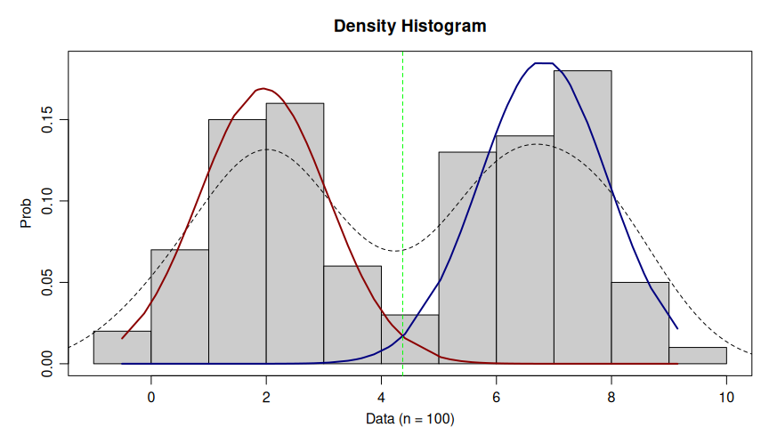

# Mixture Model Expectation-Maximization

Stu Field

18 May 2025

------------------------------------------------------------------------

# Mixture E-M

Expectation maximization (E-M) is an iterative procedure (algorithm) for
finding the maximum likelihood solution (estimates) for difficult
maximum likelihood problems (e.g. models with latent variables). This is
achieved in a similar way to *k*-means clustering, however instead of
minimizing the within-cluster variance at each iteration, we maximize
the likelihood of the data by calculating weighted-maximum likelihood
estimates of the parameters at each iteration. We are trying to fit the
model:

<span id="eq-mix-em">$$
\begin{eqnarray}
g(Y) &=& (1-\pi) \phi_{\theta_1}(y) + \pi\phi_{\theta_2}(y), \\
\text{where,} && \\
\hat\pi &=& {\cal P}(x=2),\; x \in \{1,2\}, \\
\phi_{\theta_x}(y) &=& \text{the normal density with parameters } \theta_x, x \in \{1,2\}.
\end{eqnarray}
 \qquad(1)$$</span>

------------------------------------------------------------------------

### The steps are as follows:

1.  Make **initial guesses** for:
    $\hat\mu_1,\ \hat\mu_2,\ \hat\sigma_1^2,\ \hat\sigma_2^2, \text{ and } \hat\pi$:

<span id="eq-algorithm">$$
\begin{eqnarray}
  bins &=& \text{ randomly assign data points to 1 of 2 bins} \\
  \hat\sigma_1^2,\hat\sigma_2^2 &=& 1/rexp(2, rate = sd(bins)) \\
  \hat\mu_1,\hat\mu_2 &=& rnorm(2, mean = mean(bins), sd = c(\hat\sigma_1^2,\hat\sigma_2^2)) \\
  \hat\pi &=& 0.5
\end{eqnarray}
 \qquad(2)$$</span>

1.  **Expectation**: compute *responsibilities* from posterior
    probabilities, where the responsibilities are the relative
    contribution of distribution 2 (the second mode) in *explaining*
    each data point (this is a *soft* assignment). Responsibilities of
    mode 2 for observation $i$ given the current estimates are:

$$
\hat\gamma_i = \frac{\hat\pi\phi_{\theta_2}(y_i)}{(1-\hat\pi)\phi_{\theta_1}(y_i) + \hat\pi\phi_{\theta_2}(y_i)},\quad\quad i = 1,\dots,n.
$$

1.  **Maximization**: compute *weighted* maximum likelihood to update
    the estimates:

<span id="eq-parameters">$$
\begin{eqnarray}
\hat\mu_1 = \frac{\sum\limits_{i=1}^n(1-\hat\gamma_i)y_i}{\sum\limits_{i=1}^n(1-\hat\gamma_i)},
\quad \quad \quad
\hat\mu_2 = \frac{\sum\limits_{i=1}^n\hat\gamma_iy_i}{\sum\limits_{i=1}^n\hat\gamma_i}, \\
\hat\sigma^2_1 = \frac{\sum\limits_{i=1}^n(1-\hat\gamma_i)(y_i-\hat\mu_1)^2}{\sum\limits_{i=1}^n(1-\hat\gamma_i)},
\quad \quad 
\hat\sigma^2_2 = \frac{\sum\limits_{i=1}^n\hat\gamma_i(y_i-\hat\mu_2)^2}{\sum\limits_{i=1}^n\hat\gamma_i}, \\
\hat\pi = \sum\limits_{i=1}^n\frac{\hat\gamma_i}{n}.
\end{eqnarray}
 \qquad(3)$$</span>

1.  Compute log-likelihood:

$$
{\cal L} = \sum_{i=1}^n log\big[\; (1-\hat\pi)\phi_{\theta_1}(y_i) + \hat\pi\phi_{\theta_2}(y_i)\; \big]
$$

1.  Check **convergence**: check if criterion of the log-likelihood has
    been met, if not, repeat above steps with new values of
    $\hat\mu_1,\ \hat\mu_2,\ \hat\sigma_1^2,\ \hat\sigma_2^2, \text{ and } \hat\pi$
    as initial guesses.

------------------------------------------------------------------------

## Running the Algorithm

``` r
# create a mixture distribution with 2 modes; n = 75 for each
data <- withr::with_seed(
  1001, c(rnorm(50, mean = 2, sd = 1), rnorm(50, mean = 7, sd = 1))
)

# default initial parameters
mix_fit <- withr::with_seed(1, normal_k2_mixture(data))
#> ✓ Iteration ... 39
```

## Visualizing the Algorithm

``` r
par(mfrow = c(1, 2L))
plot(mix_fit, "likelihood")
plot(mix_fit, "posterior")
```


``` r
plot(mix_fit)
```



Estimates:

``` r
mix_fit
#> ══ Mix Type: normal_k2_mixture ═════════════════════════════════════════════════
#> • n               100
#> • iter            39
#> • mu              [1.954, 6.823]
#> • sigma           [1.126, 1.119]
#> • pi_hat          0.523
#> • lambda          [0.477, 0.523]
#> • final loglik    -218.579
#> ════════════════════════════════════════════════════════════════════════════════
```
