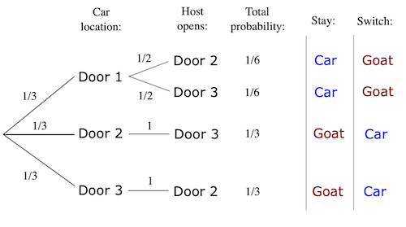
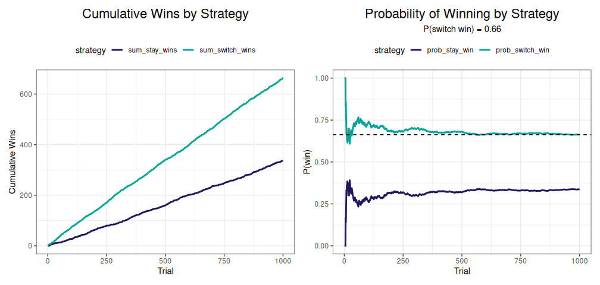

# Monty Hall Paradox

Stu Field

18 May 2025

Suppose you’re on a game show, and you’re given the choice of three
doors: behind one door is a car; behind the others are goats. You pick a
door, say `A`, and the host, who knows where the care is located, opens
another door, say `C`, which has a goat. He then asks you, “Do you want
to pick door `B`?” Is it to your advantage to switch your choice?

### Key Assumptions

For the paradox to work, there are some key assumptions (rules) about
the host’s behavior:

1.  The host must always open a door that was not picked by the
    contestant
2.  The host must always open a door to reveal a goat and never the car.
3.  The host must always offer the chance to switch between the
    originally chosen door and the remaining closed door.

### Common Mistake

Most people come to the conclusion that switching does not matter
because there are two unopened doors and one car and that it is a 50/50
choice. This would be true if the host opens a door randomly, but that
is not the case; the door opened depends on the player’s initial choice,
so the assumption of independence does not hold. As we see below,
breaking the independence assumption drastically alters the
probabilities of the remaining unrevealed doors.

------------------------------------------------------------------------

### Solution

The key insight is that the host does *not* reveal the remaining
(non-chosen) doors randomly. He *always* reveals a goat, and thus has
knowledge of where the car actually is. Incorporating this information
into the probability calculation adjusts the probability, shifting it
away from the newly revealed door to the remaining unrevealed and
un-chosen door. In a way this represents a Bayesian update to the
probability of door `B` with the knowledge that the car is *not* behind
door `C`. The posterior probability of door `B` is updated from 0.33 -\>
0.66 following the reveal that door `C` is not an option.

The problem can be reduced to a binary problem (switch or stay):

1.  The player chooses correctly and loses by switching (1/3)
2.  The player chooses incorrectly and wins by switching (2/3)

| Door A | Door B | Door C | Stay Strategy | Switch Strategy |
|:------:|:------:|:------:|:-------------:|:---------------:|
|  Goat  |  Goat  |  Car   |   Wins goat   |    Wins car     |
|  Goat  |  Car   |  Goat  |   Wins goat   |    Wins car     |
|  Car   |  Goat  |  Goat  |   Wins car    |    Wins goat    |
|        |        |        | P(car) = 1/3  |  P(car) = 2/3   |

#### Visual: probability tree

The bifurcated tree below assumes the player has chosen Door 1:



------------------------------------------------------------------------

## Simple Simulation

Perhaps the easiest way to visualize the solution is through simulation.

### Code

``` r
# Single Monty-Hall trial; win by switching?
mh_switch_win <- function() {
  true   <- sample(1:3, 1L)    # true correct door; 3 possible doors
  choose <- sample(1:3, 1L)    # player's door choice: 1/3
  # if player chooses incorrect door,
  # player wins by switching (TRUE/FALSE)
  true != choose
}
```

> Once you convince yourself that the probability of winning by
> switching is the same as the probability of choosing incorrectly,
> i.e. 1 - 1/3, the function can be simplified further.

``` r
mh_switch_win <- function() {
  runif(1) > 1 / 3
}
```

Run the simulation with the `runif()` function directly rather than
`mh_switch_win()`:

``` r
n_trials <- 1000
sim_tbl  <- tibble::tibble(
  n_sim           = seq_len(n_trials),
  switch_win      = withr::with_seed(833, runif(n_trials) > 1 / 3),
  stay_win        = !switch_win,
  sum_switch_wins = cumsum(switch_win),
  sum_stay_wins   = cumsum(stay_win),
  prob_switch_win = sum_switch_wins / (sum_switch_wins + sum_stay_wins),
  prob_stay_win   = 1 - prob_switch_win
)

# simulation results
sim_tbl
#> # A tibble: 1,000 × 7
#>    n_sim switch_win stay_win sum_switch_wins sum_stay_wins prob_switch_win prob_stay_win
#>    <int> <lgl>      <lgl>              <int>         <int>           <dbl>         <dbl>
#>  1     1 TRUE       FALSE                  1             0           1             0    
#>  2     2 TRUE       FALSE                  2             0           1             0    
#>  3     3 TRUE       FALSE                  3             0           1             0    
#>  4     4 TRUE       FALSE                  4             0           1             0    
#>  5     5 TRUE       FALSE                  5             0           1             0    
#>  6     6 FALSE      TRUE                   5             1           0.833         0.167
#>  7     7 TRUE       FALSE                  6             1           0.857         0.143
#>  8     8 FALSE      TRUE                   6             2           0.75          0.25 
#>  9     9 FALSE      TRUE                   6             3           0.667         0.333
#> 10    10 TRUE       FALSE                  7             3           0.7           0.3  
#> # ℹ 990 more rows
```

### Plot Simulations

``` r
# Cumulative wins
plot_df <- sim_tbl |>
  tidyr::pivot_longer(
  cols     = c(sum_switch_wins, sum_stay_wins),
  names_to = "strategy", values_to = "Wins"
)

p1 <- plot_df |>
  ggplot(aes(x = n_sim, y = Wins, color = strategy)) +
  geom_line(linewidth = 1) +
  scale_color_manual(values = c("#24135F", "#00A499")) +
  labs(y = "Cumulative Wins", x = "Trial",
       title = "Cumulative Wins by Strategy")

# Prob winning
plot_df <- sim_tbl |>
  tidyr::pivot_longer(
  cols     = c(prob_switch_win, prob_stay_win),
  names_to = "strategy", values_to = "prob"
)

p2 <- plot_df |>
  ggplot(aes(x = n_sim, y = prob, color = strategy)) +
  geom_line(linewidth = 1) +
  ylim(c(0, 1)) +
  geom_hline(yintercept = sim_tbl$prob_switch_win[n_trials],
             linetype = "dashed") +
  scale_color_manual(values = c("#24135F", "#00A499")) +
  labs(y = "P(win)", x = "Trial",
       subtitle = sprintf("P(switch win) = %0.2f",
                          sim_tbl$prob_switch_win[n_trials]),
       title = "Probability of Winning by Strategy")

p1 + p2
```



------------------------------------------------------------------------

### Links

<https://en.wikipedia.org/wiki/Monty_Hall_problem>
